## Ansible Dynamic Assignments(Include) and Community Roles
### From Project 12,we can already tell that static assignments use "import"Ansible module.The module that enables dynamic assignments is "include".
## Introducing dynamic assignment into the structure.
### In my [https://github.com/Hennyhola2020/ansible-config-mgt].Created a new folder and call it "dynamic assignments",create a new file inside dynamic assignments and name it "env.vars.yml".Since we will be using the same Ansible to configure multiple environments,and each environments will have certain unique attributes,such as servername,ip-address and so on,we will need a way toset values to variables per specific environment.For this reason, we will now create a folder to keep each environment's variables file.Therefore,create a new folder 'env-vars' then for each environment,create new YAML files which we will use to set variables.The variables will now look like the following
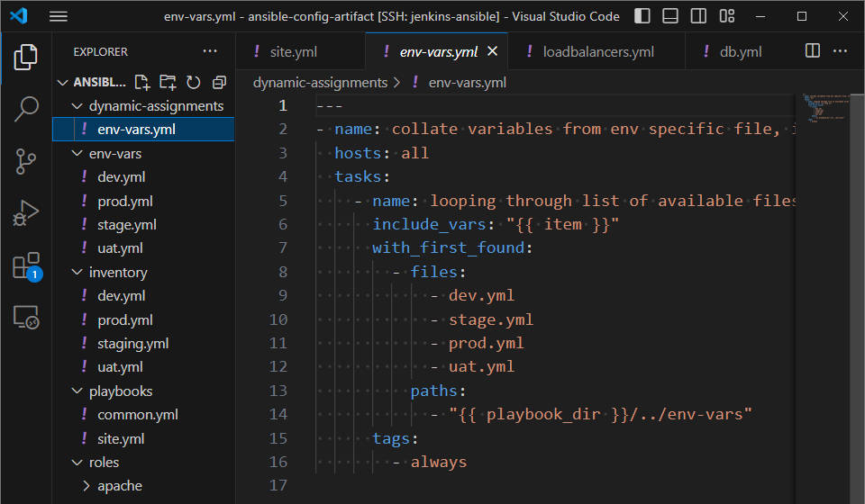.
### Then proceed to paste the instruction into the env-vars.yml
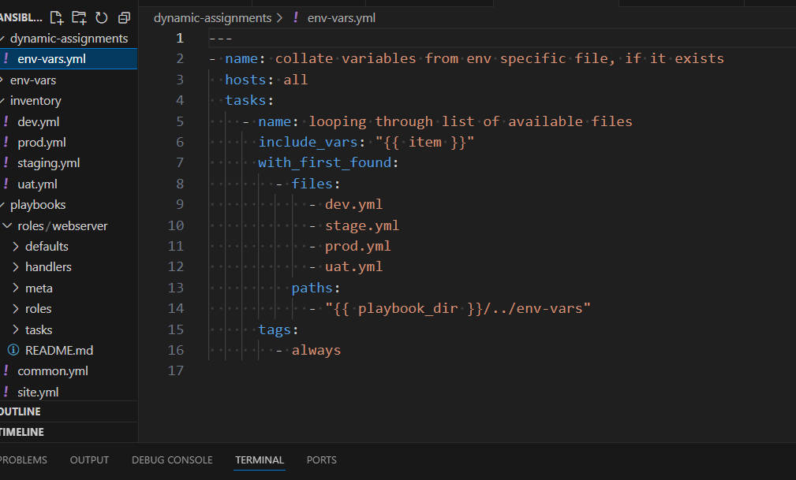
### In the above instruction. (1.)we used 'include-vars' syntax instead of 'include,this is because Ansible developers decided to separate different features of the module.From Ansible version 2.8,the 'include' module is deprecated and variants of include_* must be used.These are 
## *include_role
## *include_tasks
## *include_vars
### In the same version,variants of import were also introduces, such as
## *import_role
## *import_tasks
### 2. We made use of a *special variables*{{ playbook_dir }} and {{ inventory_file }}.{{ playbook_dir }} will help Ansible to determine the location of the running playbook,and from there navigate to other path on the filesystem. {{ inventory_file }} on the other hand will dynamically resolve to the name of the inventory file being used, then append ".yml" so that it picks up the required file within the env-vars folder.
### 3. We are including the variables using a loop."with_first_found"implies that, looping through the list of files,the first one found is used. This is good so that we can always set default values in case an environment specific env file does not exist.
## Update site.yml with dynamic assignments.
# Download Mysql Ansible Role
## We can browse available community roles from a website and use the one developed by geerlingguy.
### On Jenkins-Ansible server,git is installed with git --version,
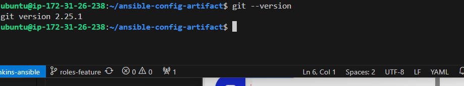
### then go to 'ansible-config-mgt' directory and run the following command:git init,git pull https://github.com/Hennyhola2020/ansible-config-mgt.git,git remote add origin https://github.com/Hennyhola2020/ansible-config-mgt.git, git branch roles-feature,git switch roles-feature
### Inside"roles" directory I created my new MySQL role
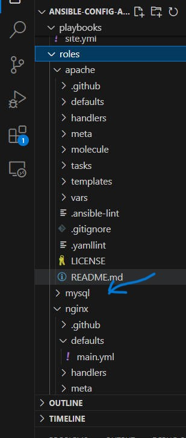 
### with ansible-galaxy install geerlingguy.mysql and rename the folder to mysql.
### Read README.md file,
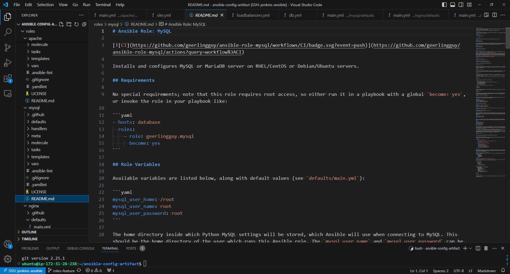
### and edit roles configuration to use correct credentials for MySQL required for the "tooling"website. Now add,commit and push the roles to github.Now with satisfaction with my code, I created a Pull Request and merge it to "main" branch on Github.
# Load Balancer roles
## We want to be able to choose which load Balancer to use,Nginx or Apache,so we need to have two roles respectively:
### 1. Nginx
### 2. Apache
## With my experienceon Ansible so far I can. 
### * Decide if I want to develop my own roles,or find available ones from the community.
### Update both *static assignment* and *site.yml* files to refer the roles.
### Load Balancer file
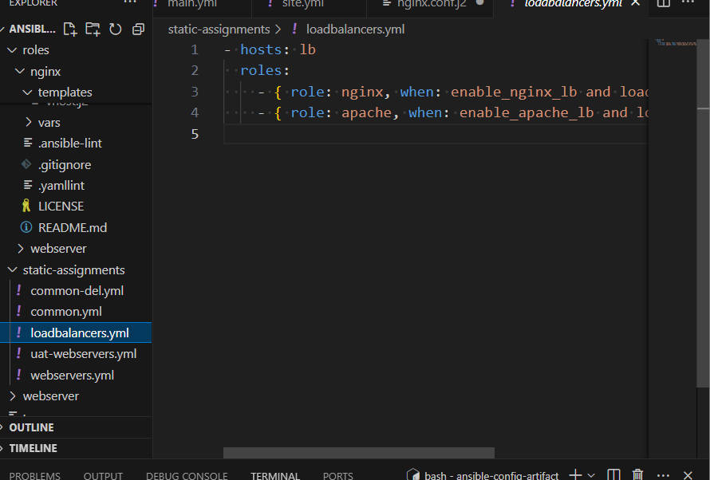
### Site.yml file 
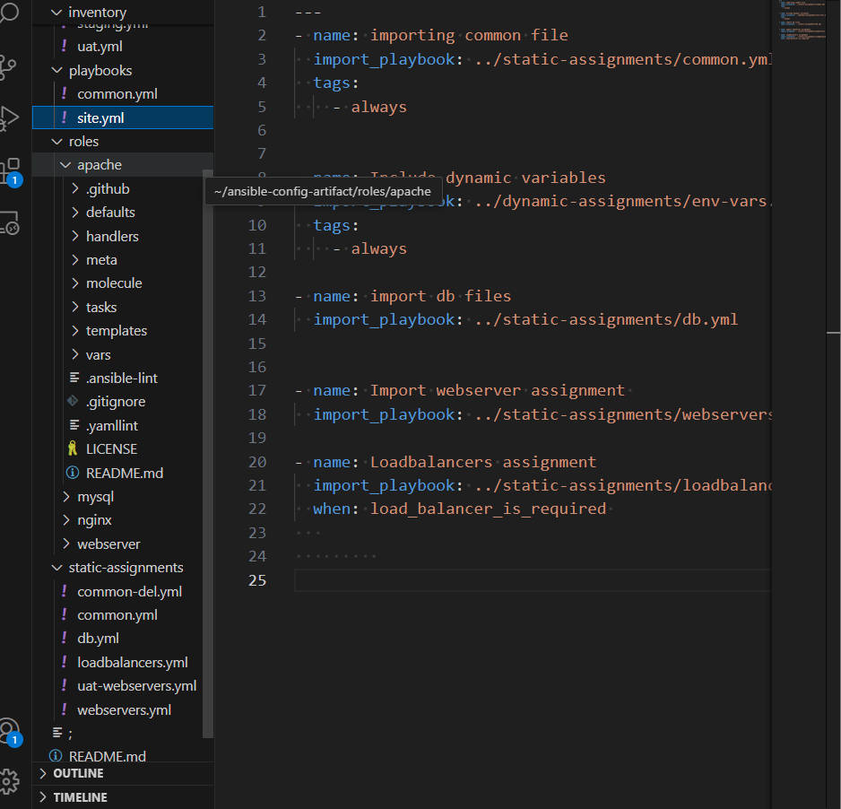
### Now you can make use of *env-vars\uat.yml* file to define which loadbalancer to use in UAT environment by setting respective environmental variable to *true*.
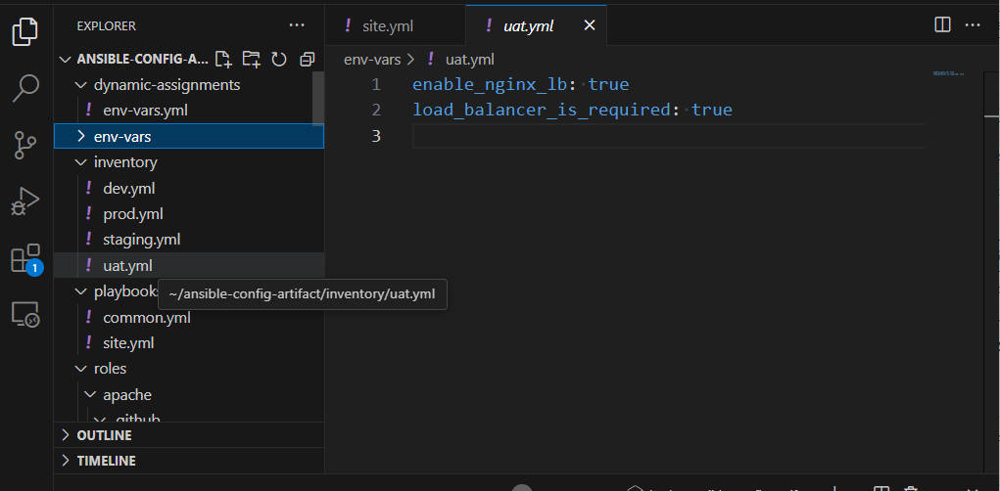
### To activate load balancer,and enable *nginx* by setting these in the respective environment's env-vars file.
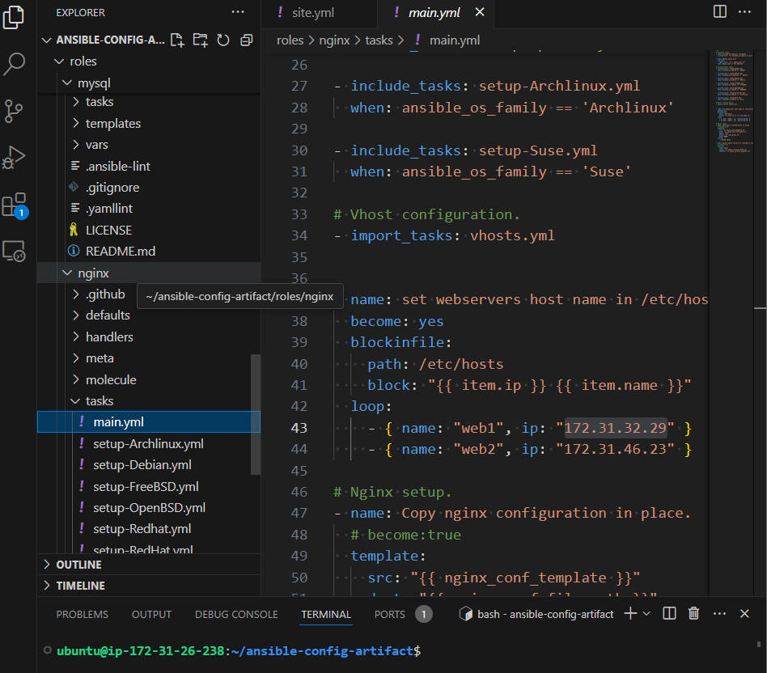.
### The same must work with *apache* LB,so I can switch it by setting respective environmental variable to *true* and other to *false*
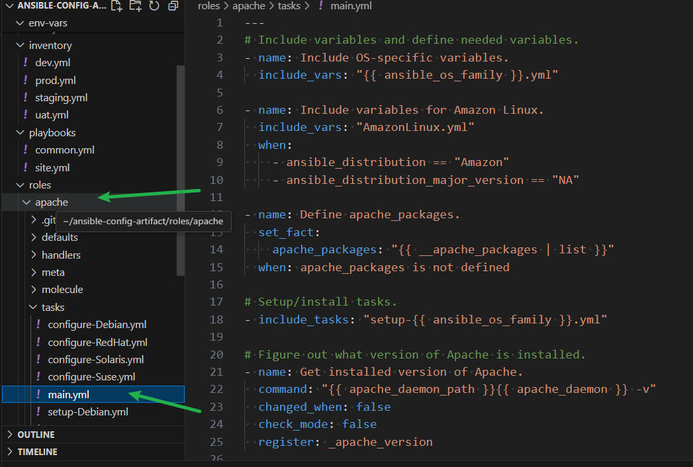
### Finally to test this by update inventory for each environment and run Ansible against each environment.
 
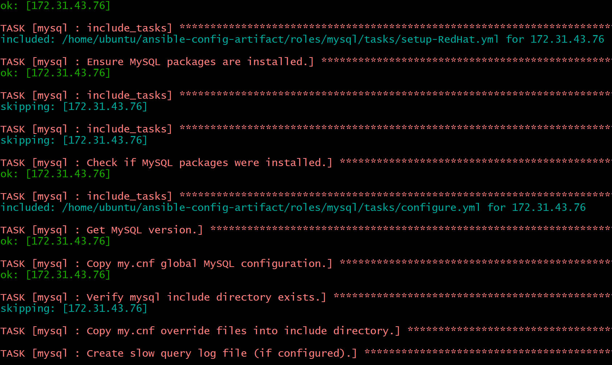 
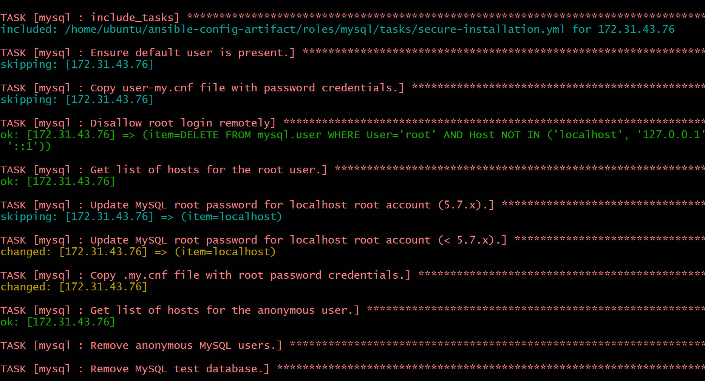 
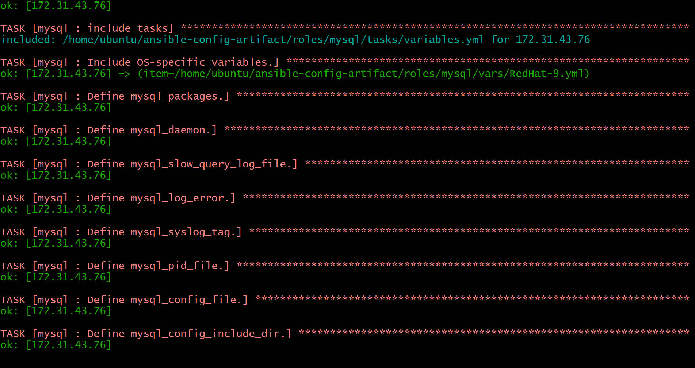