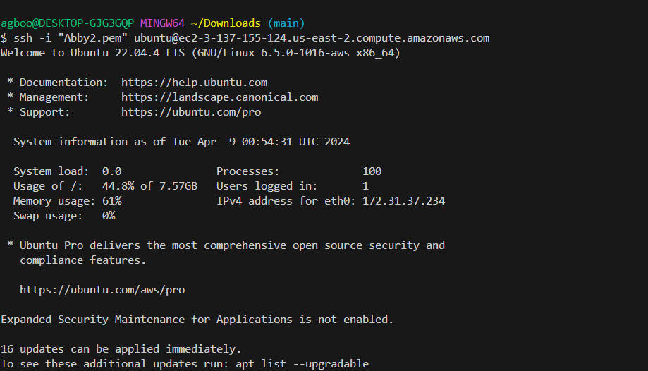

# Ansible Automate Project
## Purpose of this project is to automate the configuration of 2 Webservers, 1 DB Server, 1 NFS Server and 1 LB Server using Ansible and Jenkins

### Required Steps:
## a. Create a new repo named ansible-config-mgt
## b. Create an EC2 server named"Jenkins-Ansible" and Install and configure with ansible and jenkins, and use Elastic Ip addressing to avoid change in IPs when you shut down instance.

## c. Create a freestyle project named "ansible" on Jenkins

## d. Create a webhook link from Github repo to "Jenkins-ansible" server.

## e. Allow and test Automatic job build to "Jenkins-ansible" server on main branch from your repo.. The set up will look like the following

### Navigate to the terminal to update and install Ansible Also check the Ansible version if it's running

### Remember each you stop/start the Jenkins Ansible server- you have to reconfigure Github Webhookto a new IP address,it makes sense to to allocate an Elastic IP to the Jenkins Ansible.

## Prepare the development environment using Visual Studio Code
### Configure the VSCode to connect to the newly created Github repository.Clone down the ansible-config-mgt repo th the Jenkins-Ansible instance

### 1. In the ansible-config-mgt Github repository, create a new branch that will be used for development of a new feature.
### 2.Checkout the newly created feature branch to the local machine and start building the code and directory structure.
### 3.Create a directory and name it Playbooks- it will be use to store all the playbooks files.
### 4.Create another directory name it inventory- it will use to keep the hosts organised.
### 5. Within the playbooks folder,create the first playbook and name it 'common.yml'.
### 6. Within the inventory folder,create an inventory file for each environment(Development,Staging Testing and Production) respectively.These inventory files use .ini languages style to configure Ansible hosts. then to know the content of my host
## Set up Ansible Inventory
### Ansible uses TCP port 22 by default,which means it needs to ssh into target servers from Jenkins-Ansible host implement the ssh -agent and import your key into it.Then confirm the key has been added.ssh into the Jenkins-Ansible server using ssh agent 
### Updating the inventory/dev.yml file
## Create a common playbook
### In common.yml playbook you will write configuration for repeatable,reusable.and multi-machine tasks that is common to systems within the infrastructure. Updating the playbooks with following code 

### Commit the code into Github:
#### Use git add,commitand push the branch to Github.Once the code changes appear in master branch-Jenkins will do its job and save all the files(build artifacts)to.

## Run first ansible test
### Firstly, I install Remote devlopment in order to configure the ssh Now, it is time to execute ansible- playbook command and verify if your playbook actually works:
### Set up the VSCode to connect to the instance .Now run the playbook using the following command.Installing of wireshark and check if its running.
### Updating with Ansible architecture now look like this:
### Finally, I have automated my routine task by implementing my first Ansible project

