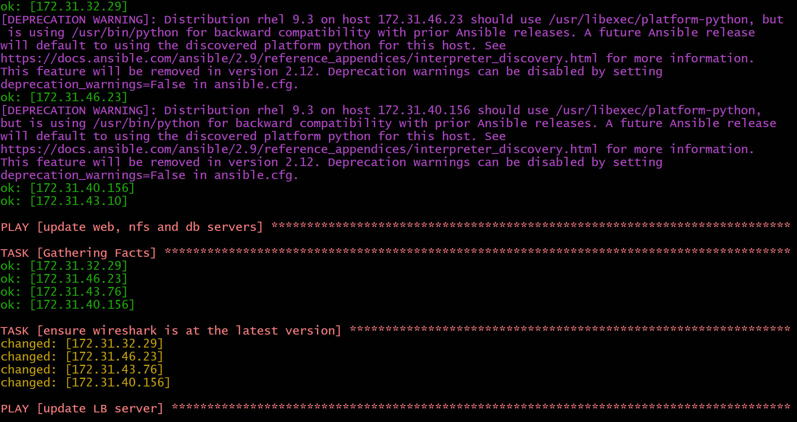

# Ansible Refactoring,assignment and imports
### In this project we continue working with" ansible-config-mgt" repository and make some improvements of our code and also learn how to use imports functionality.Imports allow to effectively re-use previously created playbooks in a new playbook also allows you to organize the tasks and reuse them when needed.
## Step 1: Before starting we begin,we makes some changes to the jenkins job.Let's enhance it by introducing a new Jenkins project/job- we will require copy Artifact plugin.Go to Jenkins -Ansible server and create a new directory called ansible-config-artifact and also change permission to this directory,so jenkins could save files there.
### Go to jenkins web console->Manage Jenkins->Manage Plugins->Available tab search for copy Artifact install the plugins without restarting Jenkins.
### Create a new Freestyle project and name it save_artifact
### This project will be triggered by completion of your existing ansible project and configure it accordingly
### The main idea of save artifacts project is to save artifacts into "/home/ubuntu/ansible-config-artifact" directory in order to achieve this I created Build step and choose "copy artifact from other project"
### Test your set up by making some change in README.MD file inside "ansible-config-mgt repository.If both Jenkins jobs have completed one after another-you shall see your files inside "/home/ubuntu/ansible-config-artifact"directory and it will be updated with every commit to your master branch.
#### Now my Jenkins pipeline is more clean and neat.

## Step 2:Refactor Ansible code by importing other playbooks into 'site.yml'.Before starting to refactor the codes,make sure that you have pulled down the latest code from 'master'(main) branch,and create a new branch and name it refactor.
### 1. Within "playbooks" folder, create a new file and name it 'site.yml'.This 'site.yml' will become a parents to all other playbooks thatwill be developed including 'common.yml'that was created previously
### 1.Create a new folder in root of the repository and name it "static assignments".This folder is where all other children playbooks will be stored.This is merely for easy organization of the work.
### 3. Move "common.yml" file into the newly created static assignments folder.
### 4. Inside "site.yml" file,import "common.yml" playbook.
### 5.Run "ansible-playbook" command against the dev environment.Since there is need to apply some tasks to the dev servers and wireshark is already installed,now go ahead and create another playbook under static-assignments and name it"common-del.yml".In this playbook,configure deletion of 'wireshark'utility and update "site.yml" with -import_playbook: ../static-assignment/common-del.yml instead of "common.yml and run against 'dev' servers.Make sure wireshark is deleted on all the servers by running wireshark--version

# Configure uat webservers with a role webserver

### Step 3 Launch 2 new EC2 instances using RHEL 8 image,we will use them as our uat servers

### - To create a role ,you must create a directory called "roles/,relative to the playbook file or /etc/ansible.The entire folder structure should look like the following after removing unnecessary directories and files.
### Now update the inventory

### -In/etc/ansible/ansible.cfg file uncomment roles_pathstring and provide a full path to the roles directory

### Now it is time to start adding some logic to the webserver role.Go into tasks directory,and within the main.yml file,start writing configuration tasks 

# Reference webserver role
### Step 4 Within the "static assignments" folder,create a new assignment for uat-webservers "uat-webserver.yml".This is where you will reference the role. so, we should have the following inside the "site.yml"

# Commit & Test 
### Commit the changes,create a pull request and merge them to master branch,make sure webhook triggered two consequent jenkins jobs,they run successfully and copied all thge files to the Jenkins-Ansible server into /home/ubuntu/ansible-config-mgt/ directory.
### Before running playbook against the uat,make sure you tunneled into the Jenkins-Ansible server via ssh-agentand run the following.Both of the UAT Web servers were configured by checking through browser
### My ansible architecture now looks like this
