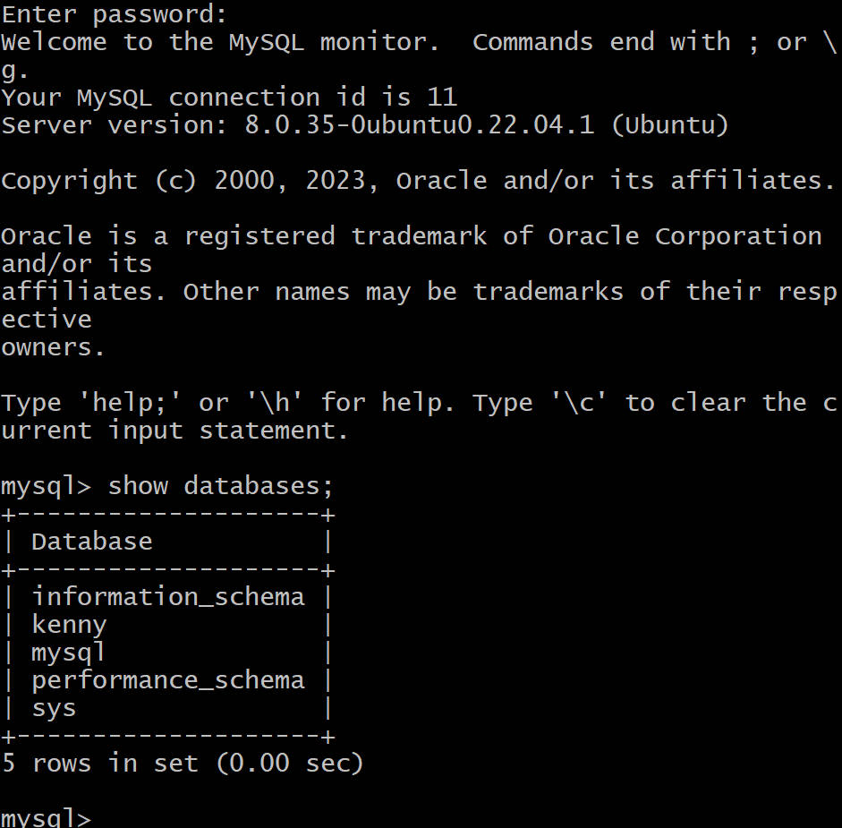

# Client-Server Architecture with MySQL.

## Client-Server is an architecture in which two or more computers are connected together over a network to send and receive requests between one another.
## In their communication,each machine has its own role:the machine sending requests is usually referred to as "Client" and the machine responding(serving) is called"Server".

## First of all, from the terminal you run the command 'curl'if you have it on your Ubuntu but if you don't have it,you will install it by running "sudo apt install curl".

# To implement a Client Server Architecture using MySQL Database Managemt System(DBMS) 
## You create and configure two linux-based virtual servers(EC2 instances in AWS) 
## On 'mysql server'Linux Server,I install MySQL Client software as follows:

## By default,both of my EC2 virtual servers are located in the same local virtual network,so they can communicate toeach other using local IP addresses,Use mysql server's local IP address to connect from mysql client.MySQL server uses TCP port 3306 by default,I open it by creating a new entry in 'Inbound rules' in 'mysql server' Security Groups.For extra security,I do not allow all IP addresses to reach my 'mysql server'.I only allow access to the specific local IP address of the 'mysql client'. then configure MySQL server to allow connections from remote  and also change the bind-address 

## From mysql client Linux Server I connect remotely to mysql server Database without using SSH. I use mysql utility to perform this action and to also show that it is successfully connected to a remote MySQL server and can perform SQL queries.Finally,the implementation of a Client Server Architecture using MySQL is done.S