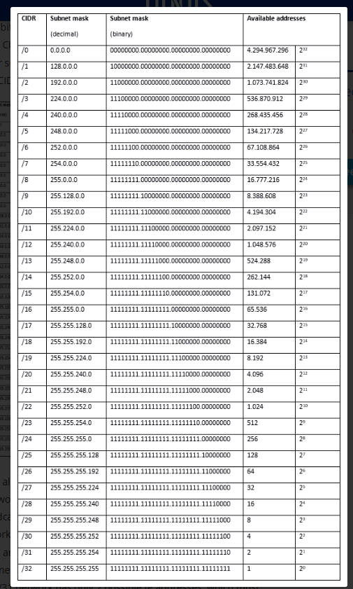

** Understanding IP Addresses and CIDR Notation**
# <u>Introduction to IP Addresses</u>

### * An IP address is a unique address that identifies a device on the internet or a local network. In essence,IP address are the identifier that allows information to be sent between devices on a network : they contain location information and make devices accessible for communication.
<u>*What is an ip address*</u>

### An **IP address** is a unique numerical label assigned to each device connected to a computer network that uses the internet Protocol for communication.It serves two main functions:**host or network interface indentification** and **location addressing**.
### <u>**Domain Name:**</u>
### A **domain name** is a human-readable address that we use to visit websites,such as *example.com*. It's much easier to remember than a string of numbers.
### <u>**How They Relate:**</u>
### When you type a domain name into your web browser,a service called the**Domain name system(DNS) trnslates the domain name into an IP address that computers use to identify each other on the network. Here's how the process  works in a diagrammatic form:
1.**User enters domain name** in the browser.
2. The browser sends a request to a **DNS server** to find the corresponding IP address.
3.The DNS server **finds the IP address** and sends it back to the browser.
4. The browser uses this IP address to **establish a connection** with the server hosting the website.
5.The server then sends the **webpage data** back to the browser,which displays the website.

# <u>Subnetting and Subnet Masks</u>
## *What is subnetting*?
### **Subnetting** is the process of dividing a larger network into smaller logical sub-networks, known as **subnets**.A **subnet** is like a neighborhood within a larger city. It allows us to create smaller,more manageable segments within a large IP network. Every device connected to the internet has a unique **IP address**. IP addresses are usually written in decimal format(e.g., 203.0.113.112). An IP address consists of two parts:-**network number** and **host identifier**

# <u>**CIDR Notation and Address Aggregation**</u>
### *What is CIDR?*
### **Classless Inter-Domain Routing(CIDR) is a method for allocating IP addresses and routing IP packets.It was introduced to improve the efficiency and scalability of IP address allocation and to extend the life of IPv4 by slowing down the rate at which the address space was being consumed.

## <u>*IP Address Aggregator*</u>

### IP Address Aggregator is a utility developed to automate minimization process and convert bunch of IPv4 addresses into smallest continuous range(s) possible.It is commonly used by network engineers working with BGP and routers.IP and Ethernet aggregation is a converged networking approach that enables the aggregation of traffic from common Ethernet(Layer 2) and IP(Layer 3) services on the same,cost-efficient network architecture. A bucket aggregation that groups documents based on the network or sub-network of an IP address is also possible.

# <u>**IP Address Classes and Private IP Address Ranges*</u>*
## *What is Classful Addressing?*
### Classful addressing is an IPv4 addressing architecture that divides addresses into five groups. Prior to classful addressing,the first eight bits of an IP address defined the network a given host was a part of.Howeverthis approach had limitations: It would have restricted the internet to just 254 networks,each containing 16,777,216 different IP addresses. As the internet grew, this inefficient allocation became problematic. To address this, classful addressing was introduced in 1981 with RFC791.

### *Let's see each of the network classes in detail:*

### **Class A Network**
#### This IP address class is used when there are a large number of hosts. In a Class A type of network, the first 8 bits (also called the first octet) identify the network, the remaining have 24 bits for the host into that network. 
#### An example of a class A address is 102.168.212.226. Here,"102" helps you identify the network and 168.212.226 identify the host. Class A addresses 127.0.0.0 to 127.255.255.255 cannot be used and is reserved for loopback and diagnostic functions.

## **Class B Network**
#### In a B class IP address, the binary addresses start with 10. In this IP address, the class decimal number that can be between 128 to 191. The number 127 is reserved for loopback,which is used for internal testing on the local machine. The first 16 bits(known as two octets) help you identify the network.The other remaining 16 bits indicate the host within the network.
#### An example of Class B IP address is 168.212.226.204,wher 168 212 identifies the network and 226.204 helps you identify the Hut network host.

## **Class C Network**
#### Class C is a type of IP address that is used for the small network. In this class, three octets are used to indent the network. This IP ranges between 192 to 223.
#### In this type of network addressing method, the first two bits are set to be 1,and the third bit is set to 0, which makes the first 24 bits of the addressthem and the remaining bit as the host address. Mostly local area network used Class C IP address to connect with the network. Example for a  Class C IP address: 192.168.178.1
## **Class D Network**
#### Class D addresses are only used for multicasting applications. Class D is never used for regular networking operations. This class addresses the first three  bits set to "1" and their fourth bit set to use for "0". Class D addresses are 32-bit network addresses. All the values within the range are used to identify multicast groups uniquely. Therefore, there is no requirement to extract the host address from the IP address,so Class D does not  have subnet mask.Example for a Class D IP address: 227.21.6.173

## **Class E Network**
#### Class E IP address is defined by including the starting four network address bits as 1, which allows you two to incorporate addresses from 240.0.0.0 to 255.255.255.255. However, E class is reserved, and its usage is never defined. Therefore, many network implementations discard these addresses as undefined or illegal. Example for a Class E IP address: 243.164.89.28

# <u>**Advanced Topics in IP Adressing**</u>
#### Advanced topics in IP addressing encompass a variety of sophisticated techniques and protocols that  address the challenges and requirements of modern networking. Below are some key advanced topics:
## 1. *Classless Inter-Domain Routing(CIDR)*
#### CIDR is a method used to create more flexible and efficient IP address allocation.Unlike classful addressing,CIDR does not use fixed classes (A,B,C). Instead,it uses variable-length subnet masking(VLSM) to allocate IP addresses more efficiently.
#### Key Concepts:
*  CIDR Notation
*  Subnet Mask
## 2. *IPv6 Addressing*
#### IPv6 is the successor to IPv4, designed to address the exhaustion of IPv4 addresses and provide enhanced features.
#### Key Features:
*  Larger Address Space
* Address Types:
   * Unicast
   * Multicast
   * Anycast
* Auto-configuration
## 3. Network Address Translation(NAT)
#### NAT is used to remap one IP address space into another, allowing multiple devices on a local network to share a single public IP address.
#### Types of NAT:
* Static NAT
* Dynamic NAT
* PAT(Port Address Translation)
## 4. Subnetting and Supernetting
#### Subnetting involves dividing a larger network into smaller, more manageable sub-networks, while supernetting combines multiple smaller networks into a larger one.
#### Subnetting:
* Creating Subnets
* Subnet Masks
#### Supernetting:
* Aggregating Networks
* Route Summarization
## 5. IP Address Management(IPAM)
#### IPAM refers to the administration of IP address spaces, ensuring efficient allocation,management,and tracking of IP addresses in a network.
#### Features:
* Automated IP Address Assignment
* Tracking and Auditing
* Conflict Detection
## 6. Advanced Routing Protocols
#### Routing protocols are used to determine the best path for data packets to travel across a network. Advanced routing protocols include:
* BGP (Border Gateway Protocol)
* OSPF (Open Shortest Path First)
* EIGRP (Enhanced Interior Gateway Routing Protocol)
## 7. Multicast IP Addressing
#### Multicast IP addressing allows a single data stream to be sent to multiple recipients,optimizing bandwidth.
#### Key Concepts
* Multicast Groups 
* Multicast Addresses
## 8. Anycast Addressing
#### Anycast addressing involves assigning the same IP address to multiple interfaces,usually spread across different locations. The network routes data to the nearest or best destination based on routing metrics.
#### Use Cases:
* Content Delivery Networks(CDNs)
* DNS Servers
## 9. Dual-Stack Implementation
#### Dual-stack implementation refers to running IPv4 and IPv6 simultaneously on the same network infrastructure,allowing for gradual transition from IPv4 to IPv6.
#### Key Benefits:
* Seamless Transition
* Compatibility
## 10.IPv4/IPv6 Tunneling 
#### Tunneling techniques encapsulate IPv4 packets (or vice versa) to facilitate communication between IPv4 and IPv6 networks.
#### *Common Methods:*
* 6to4 Tunneling
* Teredo Tunneling
### Understanding these advanced topics in IP addressing is crucial for network professionals, as they provide the tools and techniques necessary to design, implement, and manage modern IP networks efficiently.
