# Implementing Loadbalancer with Nginx
# 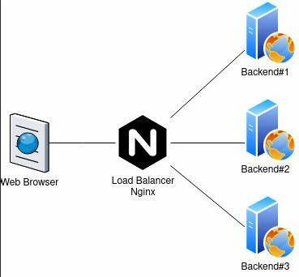
## A load balancer is a device or software that distributes network traffic across multiple servers, improving performance and reliability.A load balancer acts as a "traffic cop" that routes requests to the best available server,based on factors such as speed,capacity and availability.
## We first cd into download launch 2 EC2 instance to ssh into the terminal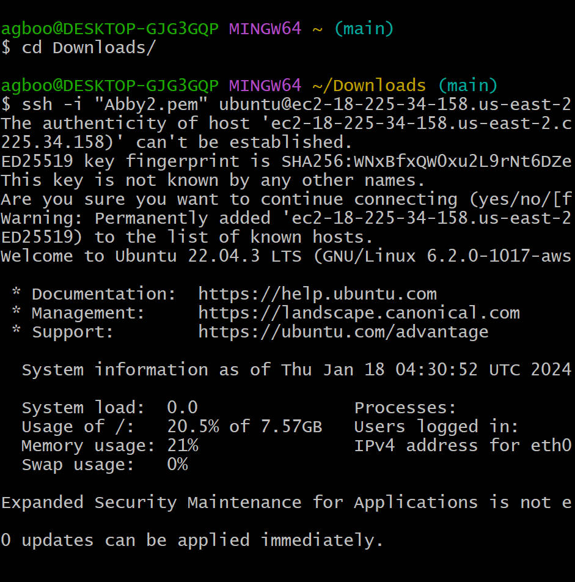 in order to install apache 2 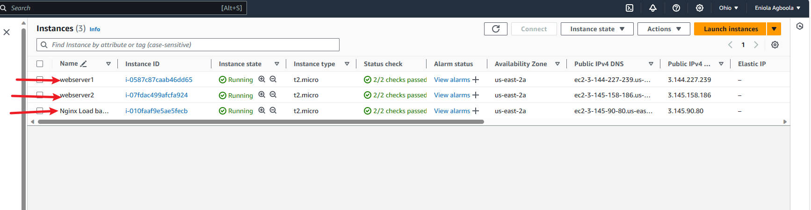then click on action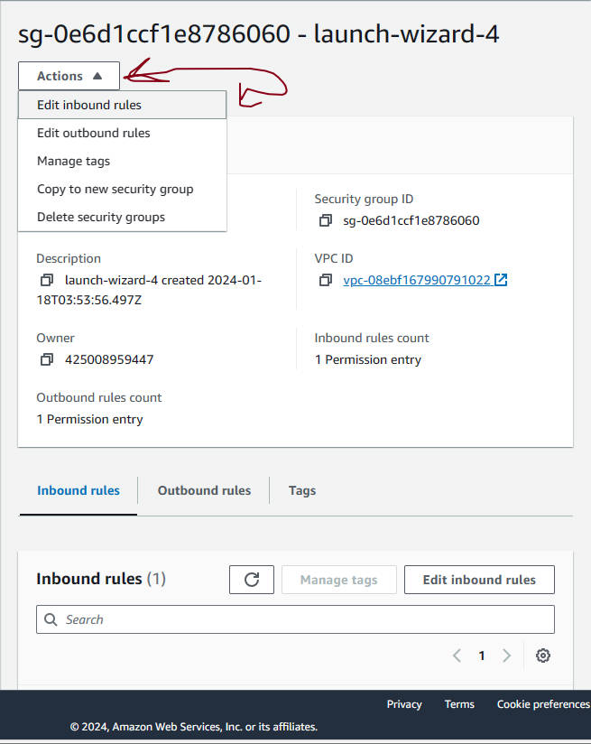 next inbound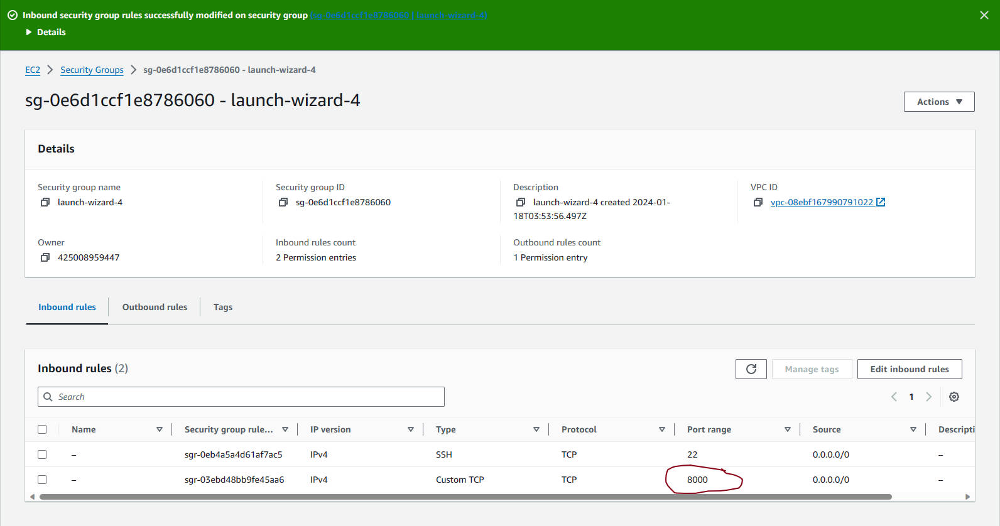
## Before anything we update both server 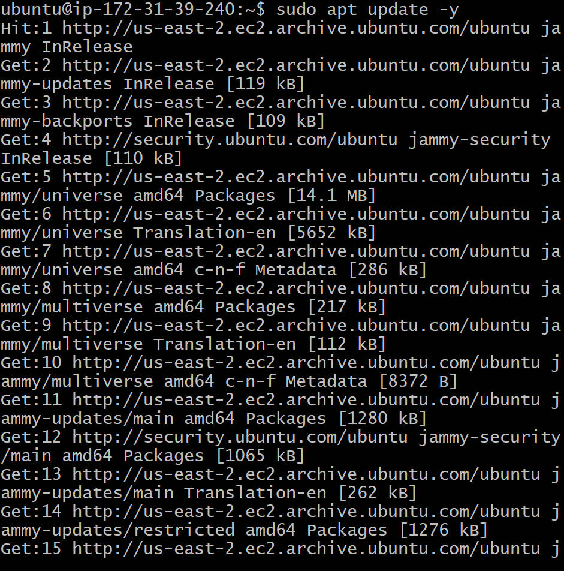 and install apache2 on both server then check the status of apache2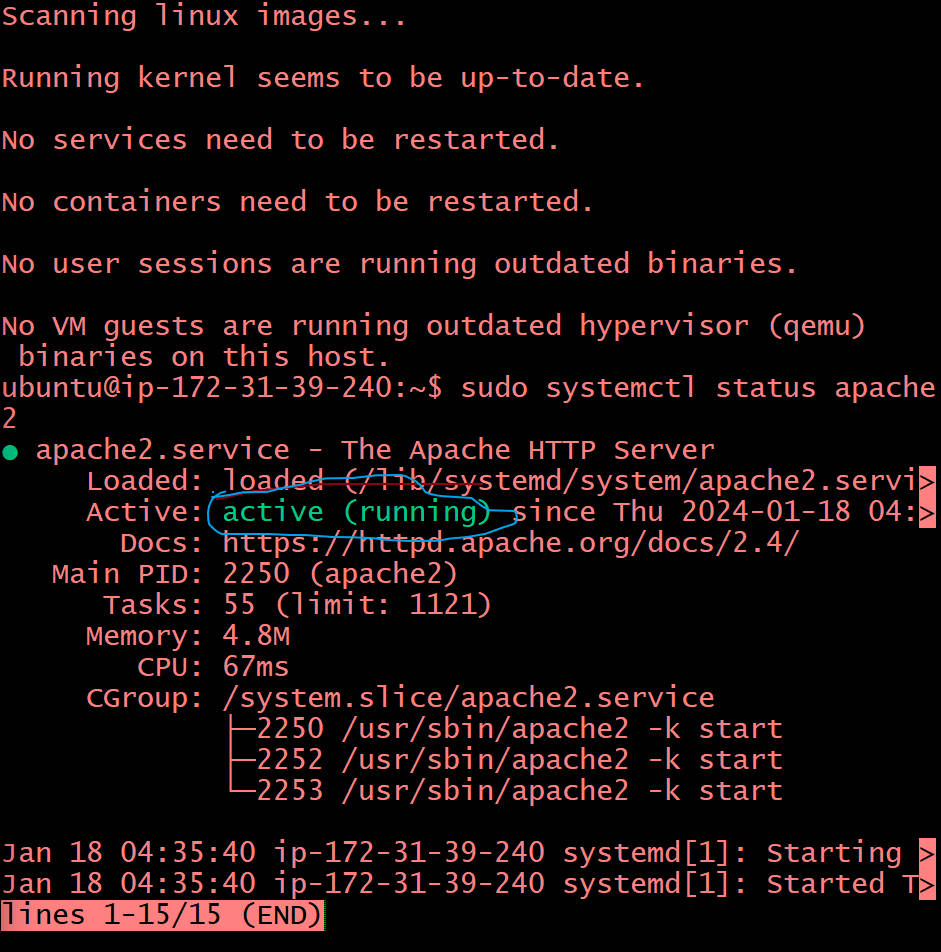
## Configuring Apache to serve content on port 8000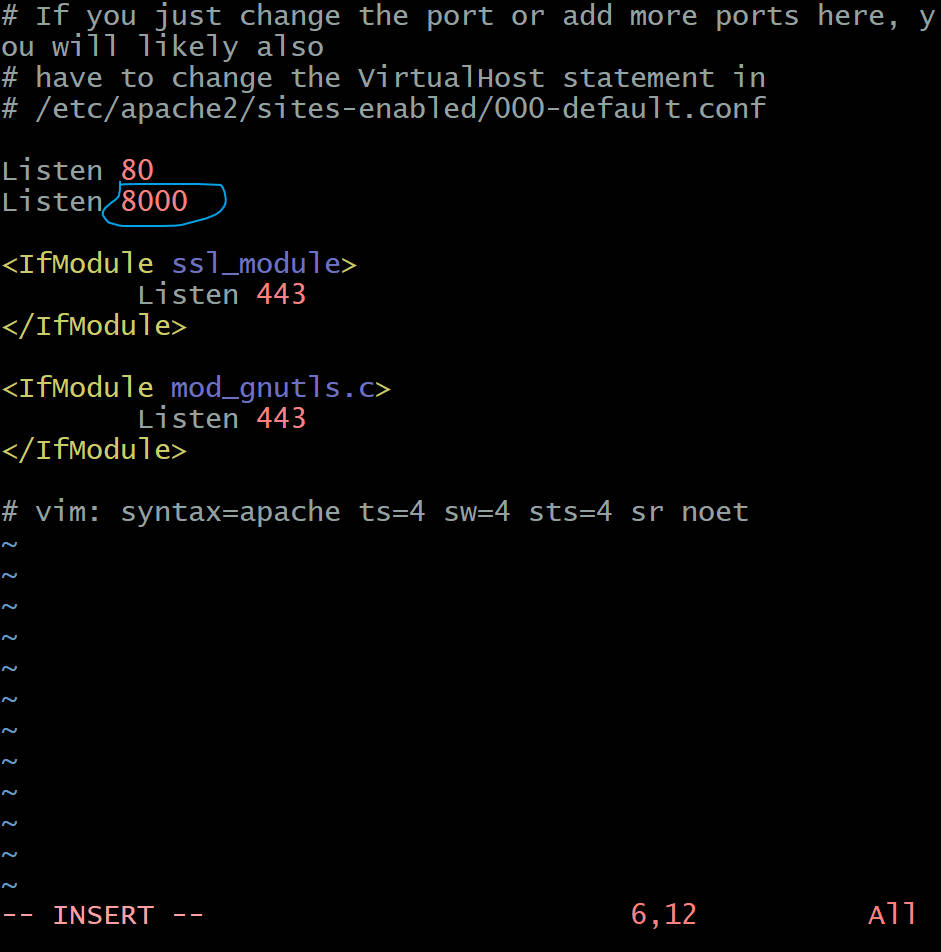.To change virtualhost 8000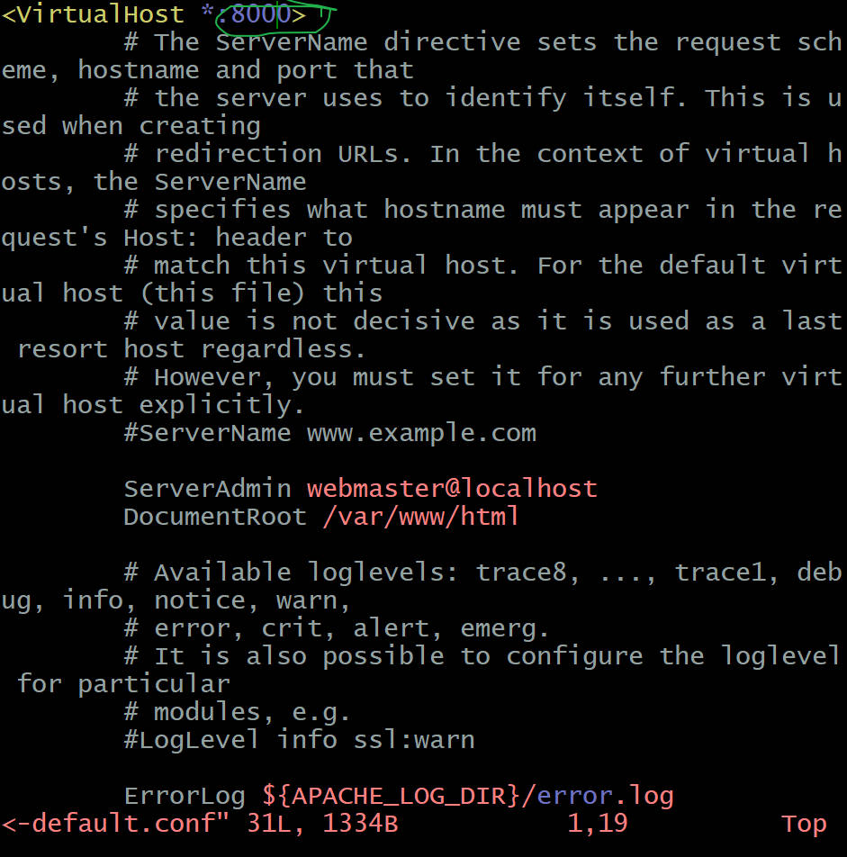,we close the file and restart apache2 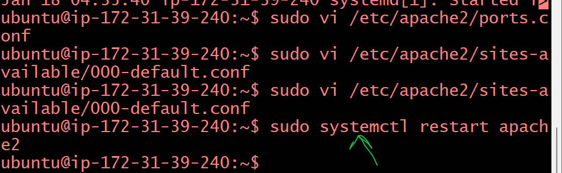,then put the IP Address in index html file on both terminal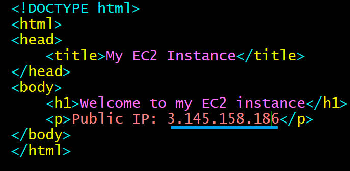 and restart apache 2 then put the IP Address on browser
## Open another instance for Nginx and launch it,follow the step above,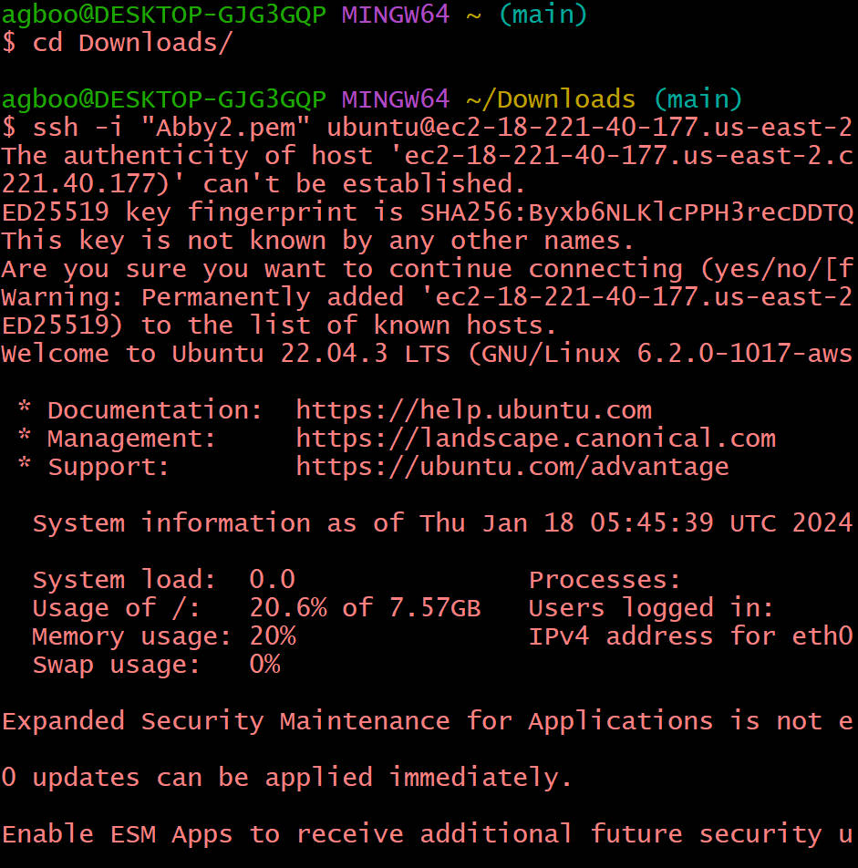  Update and install nginx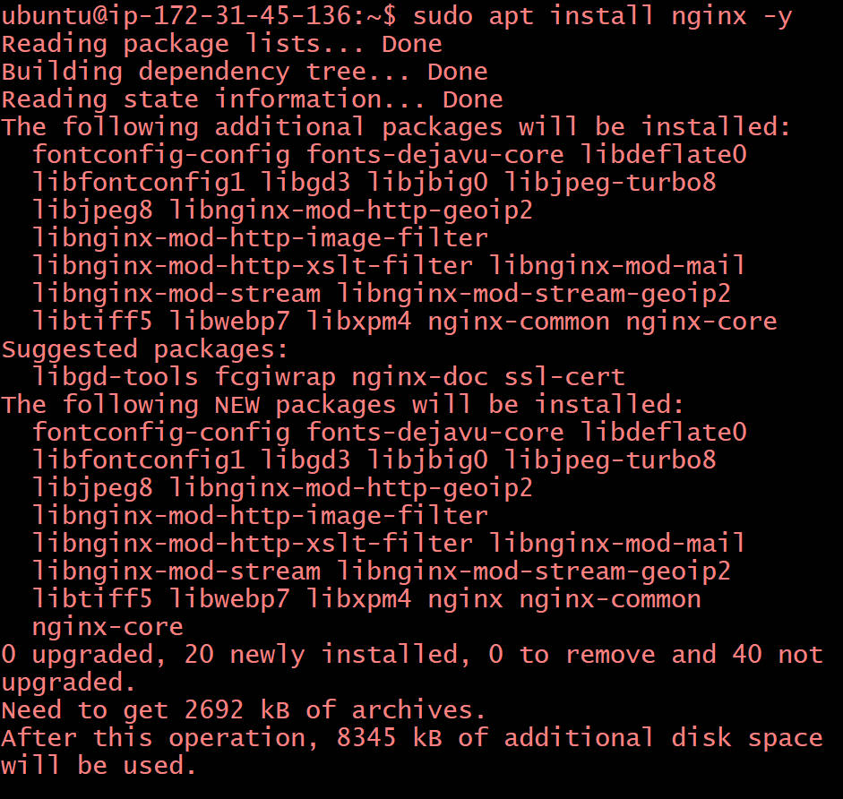 then check the status of the nginx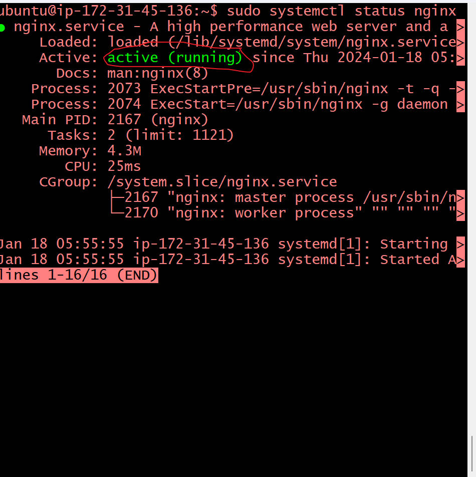.Open a configuration file for nginx to act like loadbalancer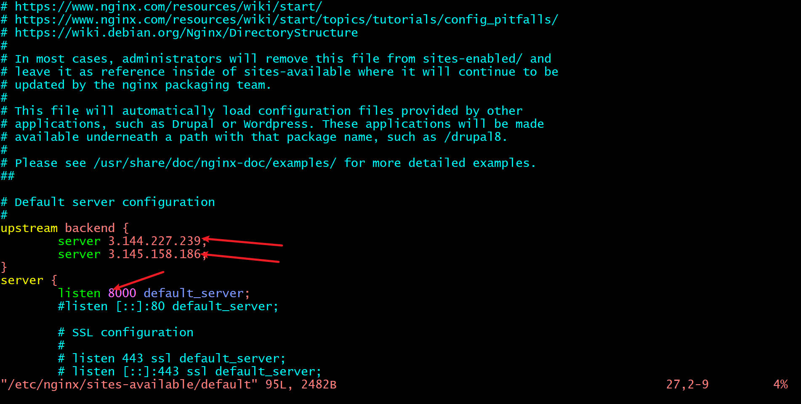 or this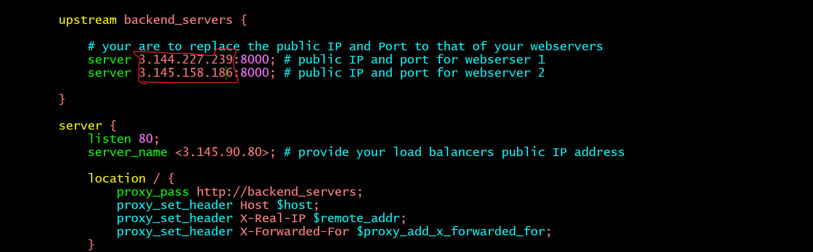.To know if the nginx 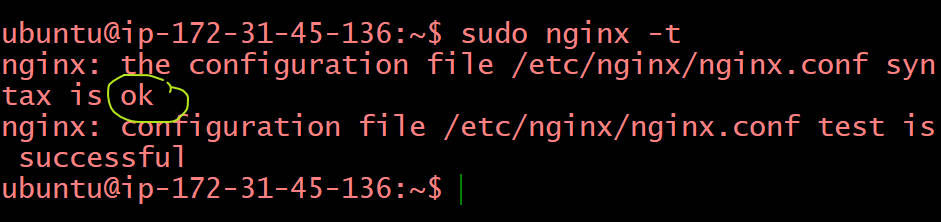.We restart nginx because there is no errors and lastly paste the IP Address on browser