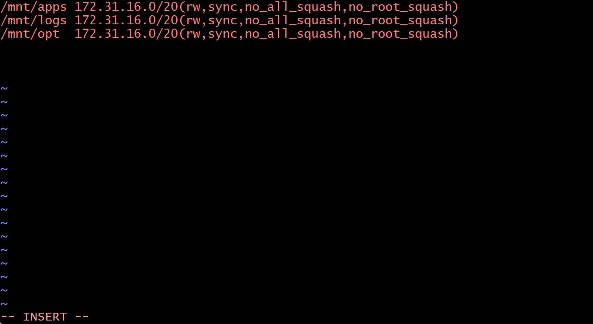

# Devops Tooling Website Solution
### In previous project I implemented a WordPress based solution that is ready to be filled with content and can be used as a full fledged website or blog.Moving forward to add some value to our solutions that your DevOps team could utilize.The tools we want our team to be able to use are well known and widely used by multiple DevOps teams,so we will introduce a single DevOps Tooling Solution that will consist of:-
#### Jenkins,Kubernetes,Jfrog Artifactory,Rancher,Grafana,Promentheus and Kibana
# Implementing a business website using NFS for the backend file storage  
### Preparing 4 instances.One for NFS and 3 for Webserver by  using Redhat 8 and create Database by using Ubuntu. So we create  3 (EBS volume) and attach all 3 volume to NFS and connect NFS to the terminal  then update NFS 
### Create volume webdata  instead of format disks as ext4,we format as xfs then logical volume 
### Now move to Database server,SSH and install mysql server and create mysql create webaccess using webserver subnet IP then grant and flush all privileges  then show databases and tables,move NFS server to install nfs,update and check status if it's running 
### Set up permission that will allow our webservers to read,write and execute files on NFS and restart NFS server 
### Configure access to NFS for clients within the same subnet 
### Check port used by NFS and open it using security groups
### In order for NFS server to be accessible from the client,we open the following ports:-TCP 111,UDP 111,UDP 2049
### SSH to webserver terminal to work on it, install nfs client  back to NFS server we creat directory(var/www)
### To make sure that the changes will persist on webserver after reboot ,open the editor and add the following with IP address  ,install apache on webserver then run the following 
### Fork the tooling source code from Darey.io Github to my github account,install git to the webserver and do git init  then clone  change directory to tooling  then this .Go back to instances and create port '80' on our webserver ,reload apache in order for my web browser to respond  then web browser  this is not what we need but atleast to know that we are on a right track,we edited the function.php and change the bind address to 0000.Go back to install some PHP dependacy  so that we can see the login site,refresh the web browser     hen login to get the following 
