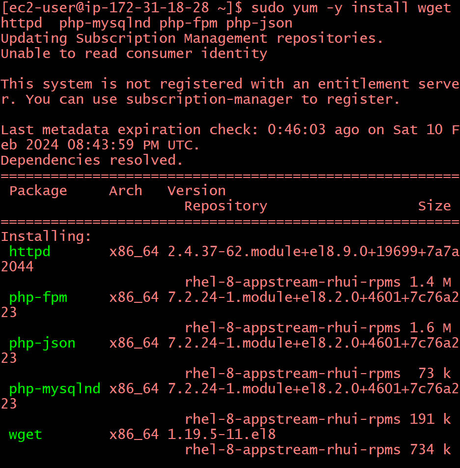

# Implementing Wordpress Website with LVM Storage Management
## Introduction
### Implementing a wordpress website with LVM storage management is a process of setting up a web server and a database server that use Logical Volume Manager(LVM) to manage their storage devices.LVM is a technology that allows you to create flexible and resizable storage configurations from physical storage devices or partitions.
### To implement a WordPress website with LVM storage management,you need to follw=ow these general steps:
### -Provision a web server EC2 instance and a database server EC2 instance on AWS,using Red Hat Enterprise Linux as the operation system.  
## Web Solution With WordPress
### The task in this project is to prepare storage infrastructure on two linux servers and implement a basic web solution using WordPress.WordPress is a free and open-source content management system written in PHP and paired with MySQL or MariaDB as its backend Relational Database Management System (RDBMS).
### As a DeVops engineer,your deep understanding of core components of web solutions and ability to troubleshoot them will play essential role in your further progress and development.
## Three-tier Architecture
### Generally,web,or mobile solutions are implemented based on what is called the Three-tier Architecture.
### Three-tier Architecture is a client-server software architecture pattern that comprise of 3 separate layers.
### 
### Presentation Layer,Business Layer and Data Access or Management Layer means A laptop or PC to serve as a client,An EC2 Linux Server as a web server where you will install WordPress,the next one is an EC2 Linux server as a database(DB)server.
## Firstly,launch an EC2 instance that will serve as "WebServer".Create 3 volumes in the same AZ as your Web Server EC2,each of  then make sure you are on availability zone
### First of all you use lsblk command to inspect what block devices are attached to the server and make sure you see all 3 newly created block  there 
### Then  to see all mount and free spoace on your server.
### Use gdisk utility to create a single partition on each of the 3 disks .Create new GPT entries,it will ask at the end if you want to proceed Yes/No if it's not right you say no but if otherwise say yes 
### Use lsblk utility to view the newly configured partition on each of the 3 disks
### Install lvm2 package using [sudo yum install lvm2] then Run [sudo diskscan] command to check for available partitions 
### Previously in ubuntu we used 'apt' command to install packages but in RedHat/CentOS a different package manager is used,so we shall use 'yum' command instead.
### We use 'pvcreate' utility to mark each of 3 disks as physical volumes(PVs) to be used by LVM  then verify that the Physical volume has been created successfully by running 'sudo pvs'
### Use 'vgcreate' utility to add all 3 PVs to a volume group(VG).Name the VG webdata-vg  then verify that the VG has been created successfully by running 'sudo vgs'
### Use 'lvcreate' utility to create 2 logical volumes.apps-lv and logs-lv.apps-lv will be used to store data for the Website while,logs-lv will be used to store data for logs 
### Verify the entire setup  then verification 
### Use mkfs.ext4 to format the logical volumes with ext4 filesystem .Create /var/www/html directory to store website files and Create /home/recovery/logs also mount /dev/webdata-vg/apps-lv /var/www/html 
### Use 'rsync' utility to backup all the files in the log directory /var/log into /home/recovery/logs then mount /var/log on logs-lv logical volume.Note that all the existing data on/var/log will be deleted.That is why /var/www/html we created is very important .Restore log files back into /var/log directory
### Update "/etc/fstab" file so that the mount configuration will persist after restart of the server.The UUID of the device will be used to update the "/etc/fstab" file.
### Test the configuration and reload the daemon,then verify your setup by running 'df-h' output must look like this:
# Installing wordpress and configuring to use MySQL Database
## Launch a second RedHat EC2 instance that will a role-'DB Server'Repeat the same steps as for the Web Server,but instead of "apps-lv"create "db-lv" and mount it to "/db" directory instead of /var/www/html/.
### Open another terminal to work on Database server.Run 'lsblk' and make sure you see all the 3 newly created block devices there .Use 'df-h' command to see all mounts and free space on my server,then use gdisk utility to create a single partition  
### Use 'lsblk' utility to view the newly configured partition on each of the 3 disks.
### Install lvm2 packages using 'sudo yum install lvm2 and run 'sudo lvmdiskscan' command to check for available partitions
### Use 'pvcreate' utility to mark each of 3 disks as physical volumes to be used by LVM 
### Verify that my Physical volume has been created successfully by running 'sudo pvs'
### Use 'vgcreate' utility to add all 3 PVs to a volume group(VG) and verify that your VG has been created successfully by running 'sudo vgs' 
### Use 'lvcreate' utility to create 2 logical volumes,db-lv and logs-lv 
### Verify the entire setup 
### Use mkfs.ext4 to format the logical volumes with ext4 filesystem. Create /db directory to store website files,Create /home/recovery/logs .Mount /db on db-lv logical volume.Then 'rsync' utility to backup all the files in the log directory then mount /var/log on logs-lv logical volume.Now restore log files back into /var/log directory.Update '/etc/fstab'file so that the mount configuration will persist after restart of the server.The UUID of the device will be used to update the '/etc/fstab'file,mount and reload.
## Install WordPress on the Web Server EC2
### Update the repository by running the following command .Install Wget .Now start Apache 
### To install PHP and it's dependencies.Restart Apache and download wordpress and copy wordpress to /var/www/html  then configure SELinux Policies.
## Install MySQL on Database server EC2  and 
### Verify that the service is up and runing by using 
# Configure DB to work with WordPress
###  
## Configure WordPress to connect to remote.Open MySQL port 3306 on DB Server EC2 and allow access to the DB server only from Web Server's IP address and specify source as /32.
### Install MySQL client and test that there is connection from Web Server to DB server by using 'mysql-client..Access the link from the browser  and fill out my DB credential 
### Wordpress has successfully connected my remote MySQL database 
# CONGRATULATIONS!