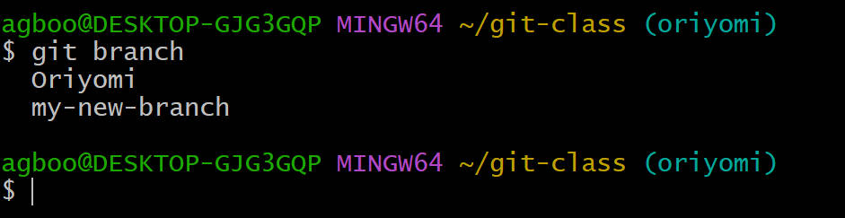
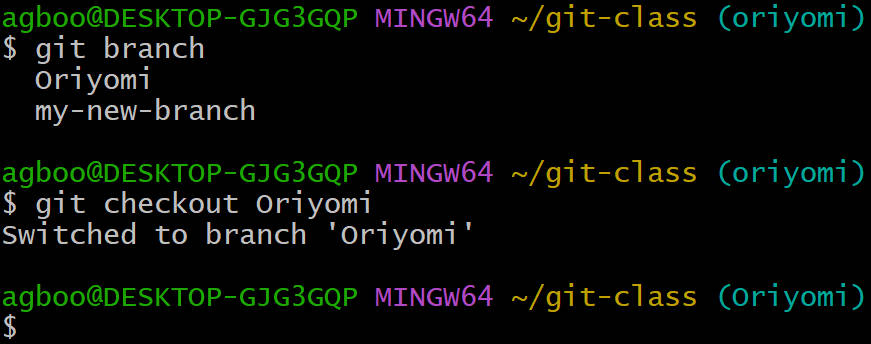
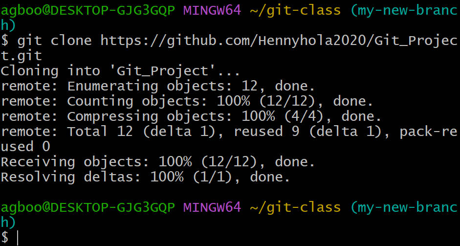
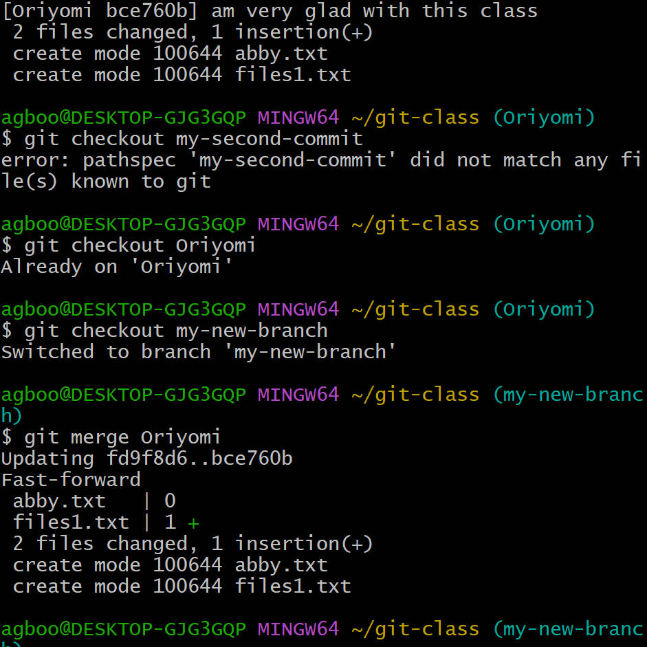
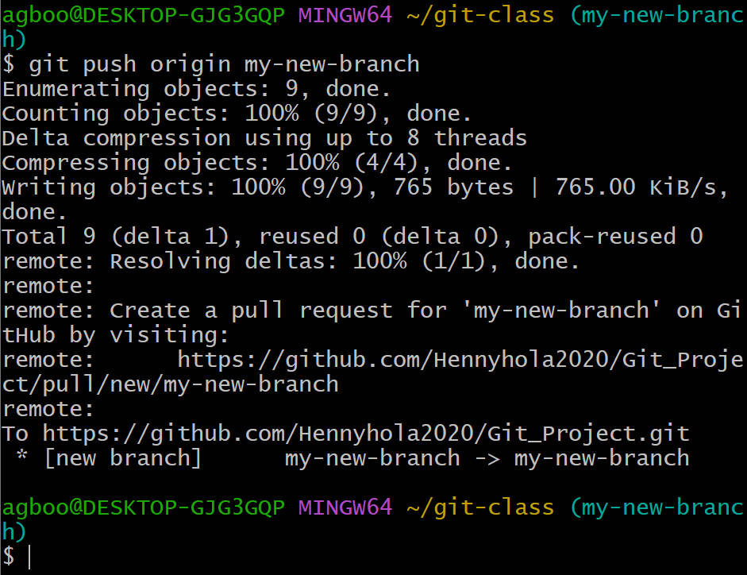
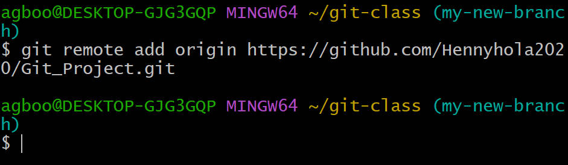

# Branch
## A branch allows you to create a separate line of development from the main branch,which is called master.
# synstax
### "git branch"

# Checkout_branch
## This git checkout command lets you navigate between the branches created by git branch also updates the files in he working directory to match the version stored in that branch,it tells Git to record all new commitson that branch.
# syntax
### git checkout (branch-name)

# Git_clone
## The git clone command is used to create a copy of a specific repository or branch within a repository.When you clone a repo you get a copy of the entire history of the repo.
# syntax
### git clone (repository-link)

# Git_merge
## Git merge will help to combine the changes from two or more branches into a single branch.
# syntax
### git merge(name of the current branch)

# Git_push
## This command allows us to transfer files from the local repository to remote repository.You can use git push to share your work with other collaborators or to publish your code online.
# syntax 
### git push origin (branch name)

# Git_remote add
## This is a command that add a new remote to your local repository.You can also use to track a new remote repository.
# syntax
### git remote add origin(repository link)

