# Apache2
## An apache allows software developers to alter the source code of existing software's source code,copy the original source code or update the source code.
# syntax
### 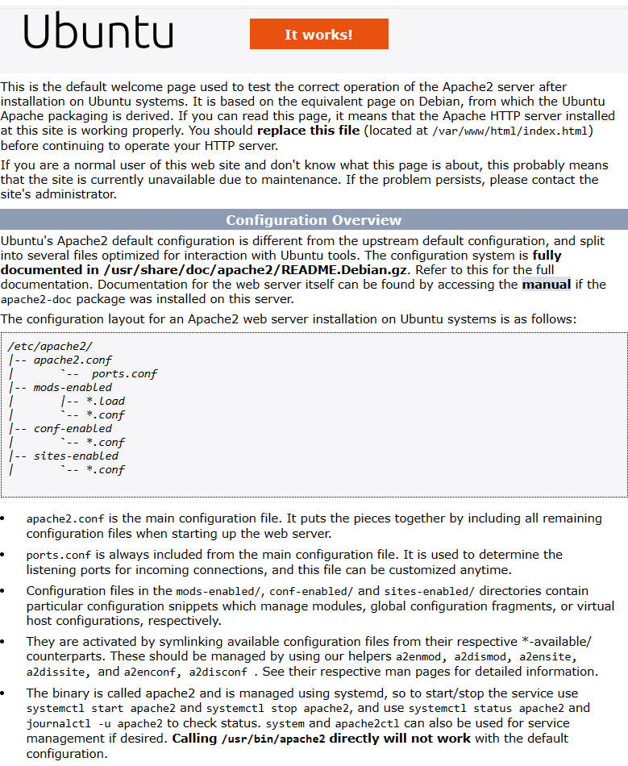

# Apt-install-php
## This is a command to install php7.4 on ubuntu.PHP is a script language for web development.
# syntax
### 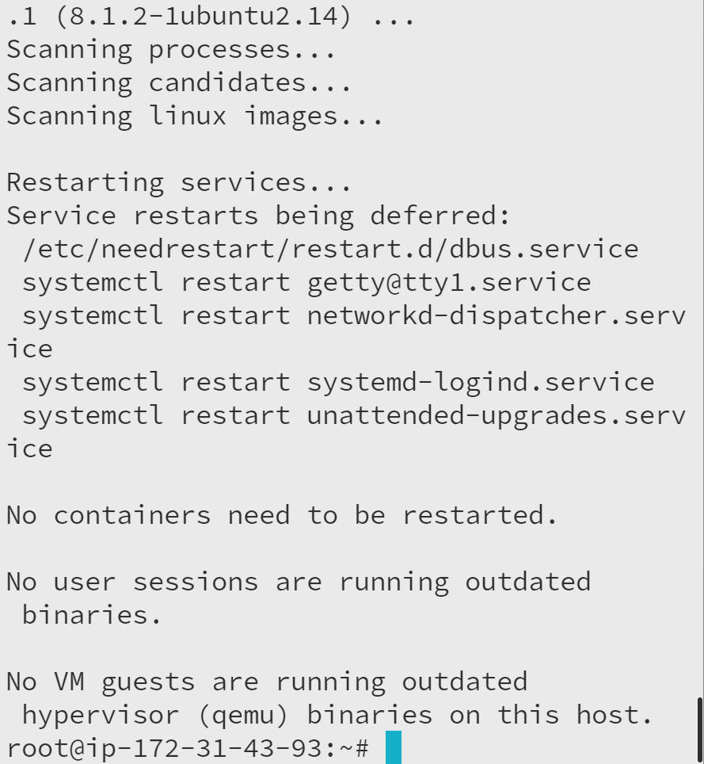

# Kernel-upgrade
## This is the process of updating the existing kernel with a new one.The kernel is the core of the system and is responsible for managing the system's resources and  providing a bridge  between the hardware and software components of the system.
# syntax
### 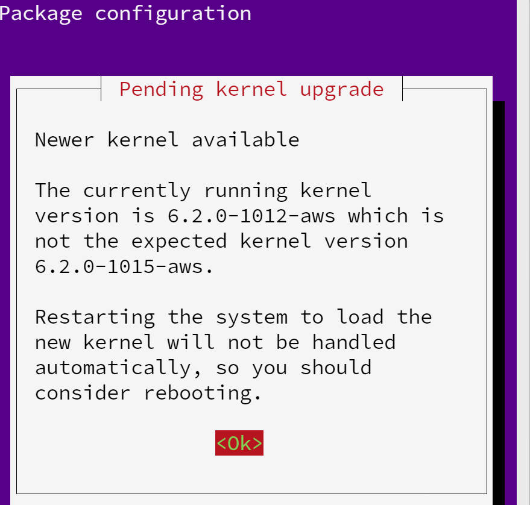

# mysql -p
## -p is used to enter password.This is simply the way to execute the mysql command as the root user (-u root),prompting for password (-p).
# syntax
### 

# mysql-server
## The mysql-server package allows to run a MYSQL server which can host multiple databases and process queries on those databases.
# syntax
### 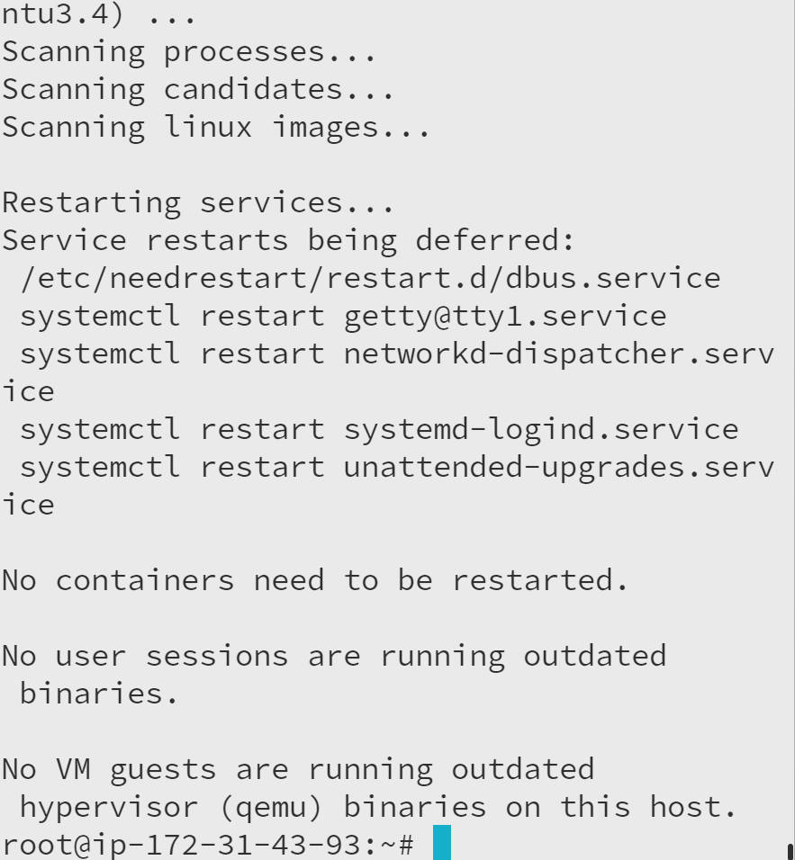

# passwd-validation
## Password validation is a process of ensuring that a password meets certain criteria in order to be considered strong and secure.
# syntax
### 

# php -v
## This command is one of the possible ways to check a version on your current PHP installation.
# syntax
### 

# php-confirmation
##  This is simply just to confirm php(yes/no)
# syntax
### 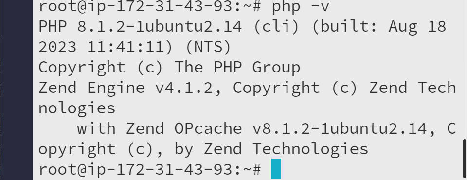

# php
## PHP is the most widely used open source and general purpose server side scripting language used mainly in web development to create dynamic websites and applications.
# syntax
### 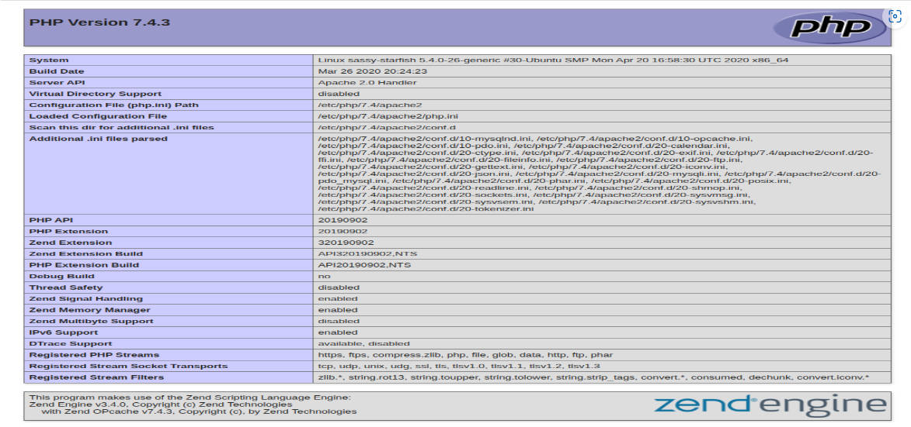

# phpinfo
## This create a single-line script,if you need in-depth information on your installation.
# syntax
### 

# sudo systemctl reload apache2
## This is command used to reload the configuration files of the Apache web server without stopping the service.This command is equivalent to "sudo service apache2 reload".
# syntax
### 

# secure-installation
## This is designed to set a few initial parameters that are more secure than the default Ubuntu(and MySQL) installation.
# syntax
### 

# sudo chown
## Sudo chown is a linux command that stands for change owner.It is used to change the user and/or group ownership of a file.
# syntax
### 

# sudo mkdir
## This is a command for creating directories in linux with root access.
# syntax
### 

# sudo-ls
## The sudo ls command is used to list the contents of a directory.It lists files and directories in alphabetical order.
# syntax
### 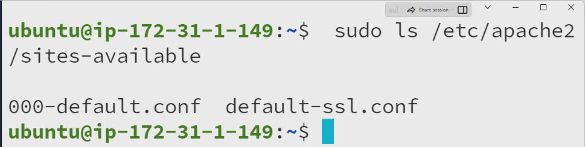

# sudo-mysql
## It's simply the way to execute the mysql 'command'as the user.
# syntax
### 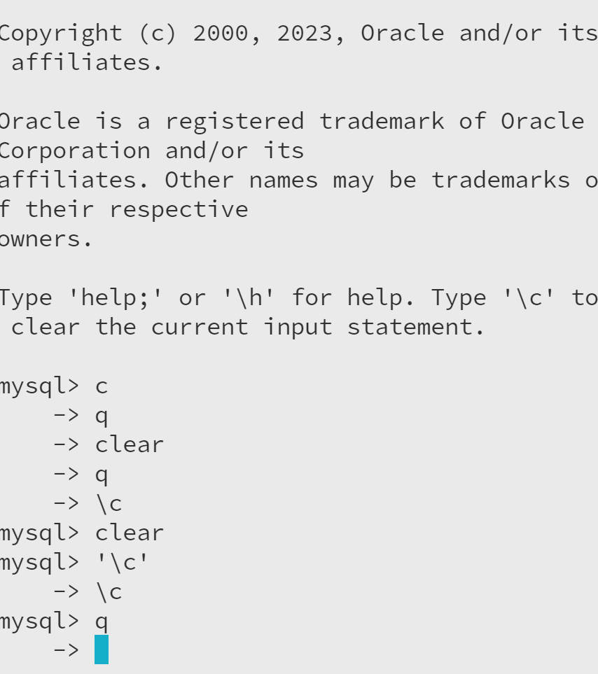

# sudo-rm
## Sudo rm means running rm command as the super user.The rm command is used to delete files and directories in linux and other Unix-like systems.
# syntax
### 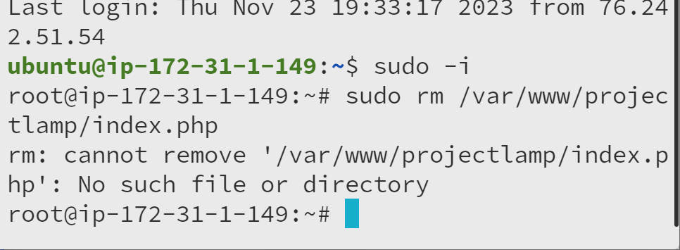

# sudo-vi
## Sudo vi is a command used to "edit system files".Sudo is used to execute a command as the superuser,while vi is a text editor based on the visual mode.
# syntax
### 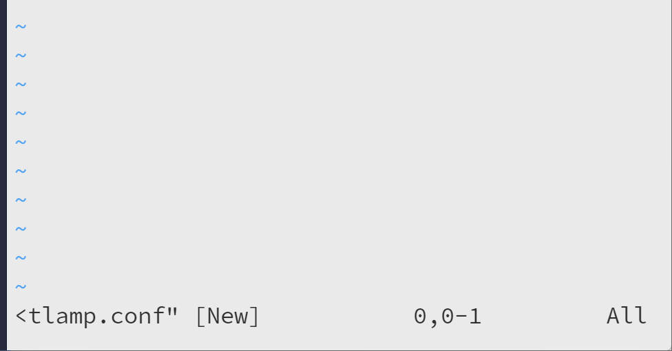

# sudo-vim
## Vim is an advanced and highly configurable text editor built to enable efficient text editing using superuser.
# syntax
### 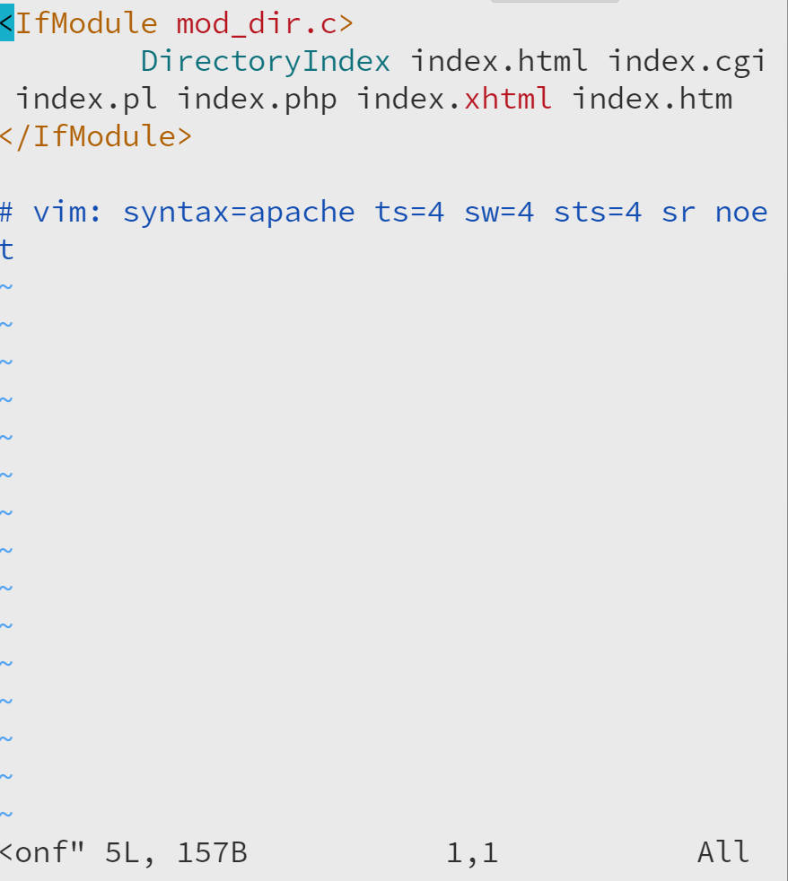

# virtualhost
## A virtual host is a type of "hosting service provider" that focuses on virtual infrastructure solutions,including virtual servers,computers,storage and other hybrid platforms that enable the hosting of data, applications and/or services.
# syntax
### 

