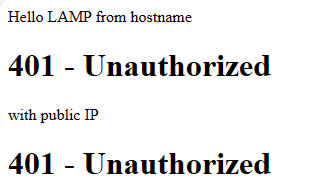

# Apache2
## An apache allows software developers to alter the source code of existing software's source code,copy the original source code or update the source code.
# syntax
### 

# Apache2ctl_configtest
## The configtest command will cause Apache2 to read the config files and report any configuration errors.The apache2 server will not start if you have syntax errors in your configuration files.
# syntax
### 

# Apt-install-php
## This is a command to install php7.4 on ubuntu.PHP is a script language for web development.
# syntax
### 

# Apt_update
## This is used to install the newest versions of all packages currently installed on the system from the sources enumerated.Packages currently installed with new versions available are retrieved and upgraded.
# syntax
### 

# curl_test
## This is use to check availability of a server. Curl is a command-line utility for transfering data from or to a remote server.
# syntax
### 

# Install_apache2
## The installation is pretty straightforward.On ubuntu and Debian systems,the "Apache package and the service"is called apache2.
# syntax
### 

# IP_Address
## IP addresses are unique identifiers assigned to internet-connected devices,and they're required for your device to access the internet.An IP address is a string of numbers assigned to an internet-connected device.The network uses the IP address to communicate with other computers,websites,and all parts of cyberspace.
# syntax
### 

# localhost
## Localhost can be seen as as a server that is used on your computer.Localhost is always your computer.localhost is not just the name for the virtual server but it is also its domain name.
# syntax
### 

# mysql_secure_installation
## This is a shell script developed for securing the MySQL server installation on Unix systems.The script configures security settings and allows you to:Set a password for root accounts.
# syntax
### 

# mysql-server
## The mysql-server package allows to run a MYSQL server which can host multiple databases and process queries on those databases.
# syntax
### 

# php -v
## This command is one of the possible ways to check a version on your current PHP installation.
# syntax
### 

# php
## PHP is the most widely used open source and general purpose server side scripting language used mainly in web development to create dynamic websites and applications.
# syntax
### 

# phpinfo
## This create a single-line script,if you need in-depth information on your installation.
# syntax
### 

# sudo systemctl reload apache2
## This is command used to reload the configuration files of the Apache web server without stopping the service.This command is equivalent to "sudo service apache2 reload".
# syntax
### 

# ssh.connection
## The Secure Shell(SSH) protocol is a method for securely sending commands to a computer over an unsecured network.SSH uses cryptography to authenticate and encrypt connections between devices.
# syntax
###  

# sudo_a2ensite_projectlamp
## a2ensite is a script that enables the specified site(which contains a<virtualhost>block) within the apache2 configuration.
# syntax
### 

# sudo_dissable_apache2_ default
## This dissables apache2 at startup but is not removed so it can be enabled again.
# syntax
### 

# sudo_echo
## This is commonly used to display text strings or command results as messages.
# syntax
### 

# secure-installation
## This is designed to set a few initial parameters that are more secure than the default Ubuntu(and )MySQL installation.
# syntax
### 

# sudo chown
## Sudo chown is a linux command that stands for change owner.It is used to change the user and/or group ownership of a file.Sudo mkdir:This is a command for creating directories in linux with root access.
# syntax
### 

# sudo-ls
## The sudo ls command is used to list the contents of a directory.It lists files and directories in alphabetical order.
# syntax
### 

# sudo-mysql
## It's simply the way to execute the mysql 'command'as the user.
# syntax
### 

# sudo-rm
## Sudo rm means running rm command as the super user.The rm command is used to delete files and directories in linux and other Unix-like systems.
# syntax
### 

# sudo-vi
## Sudo vi is a command used to "edit system files".Sudo is used to execute a command as the superuser,while vi is a text editor based on the visual mode.
# syntax
### 

# sudo-vim
## Vim is an advanced and highly configurable text editor built to enable efficient text editing using superuser.
# syntax
### 

# virtualhost
## A virtual host is a type of "hosting service provider" that focuses on virtual infrastructure solutions,including virtual servers,computers,storage and other hybrid platforms that enable the hosting of data, applications and/or services.
# syntax
### 

