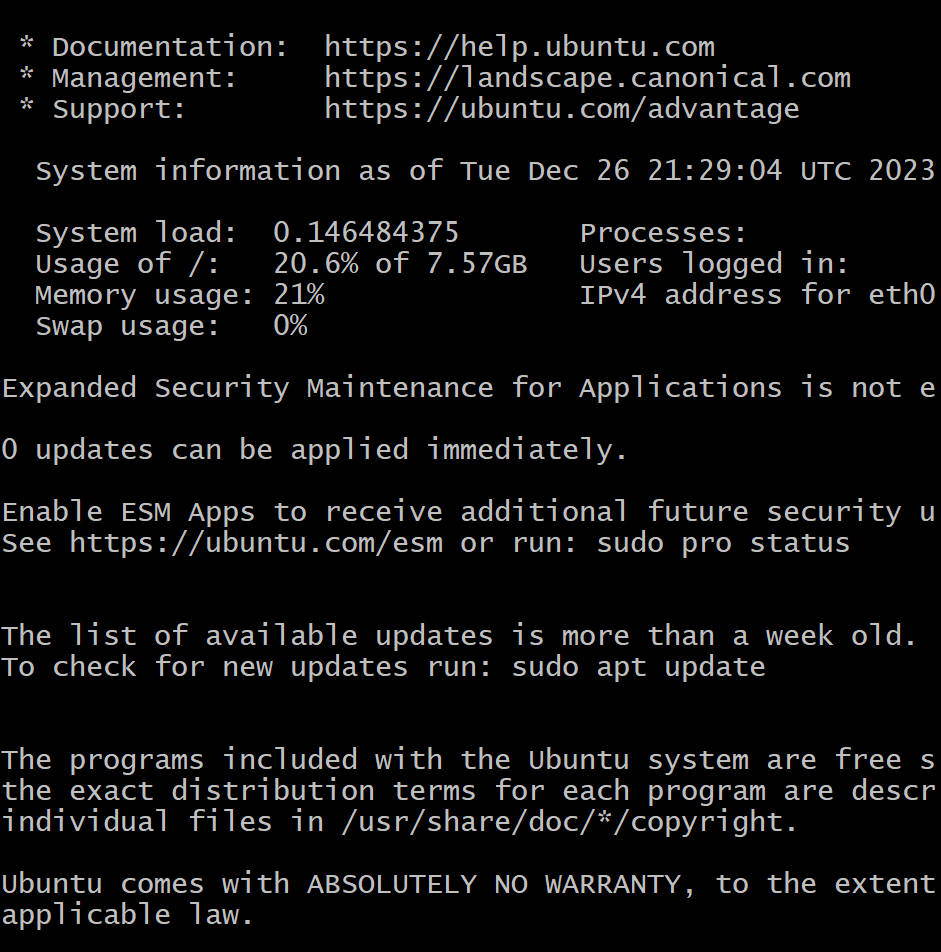
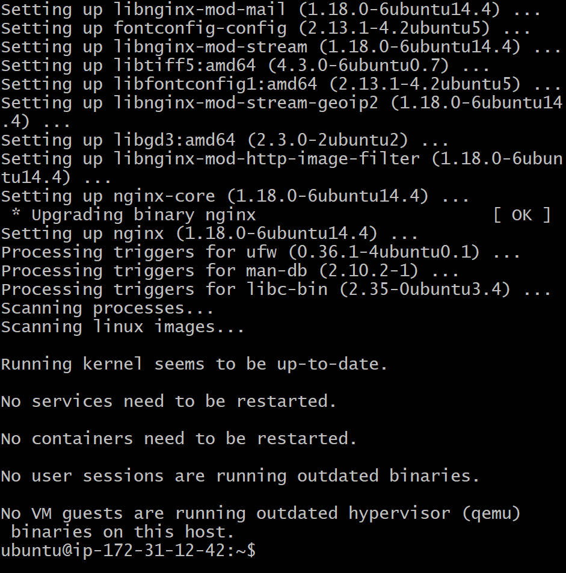
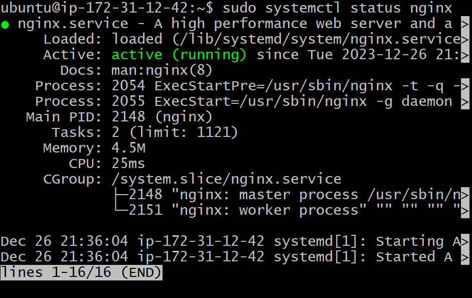
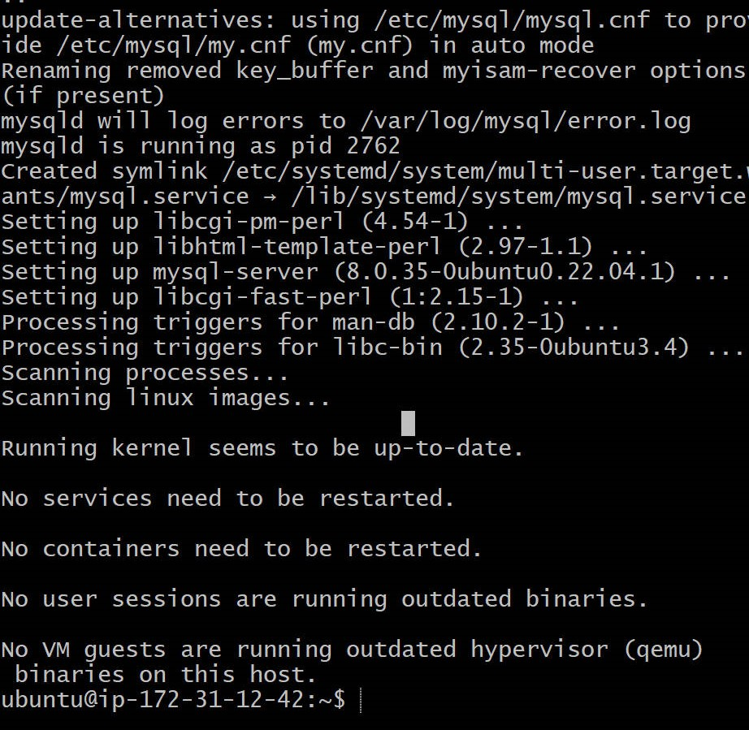
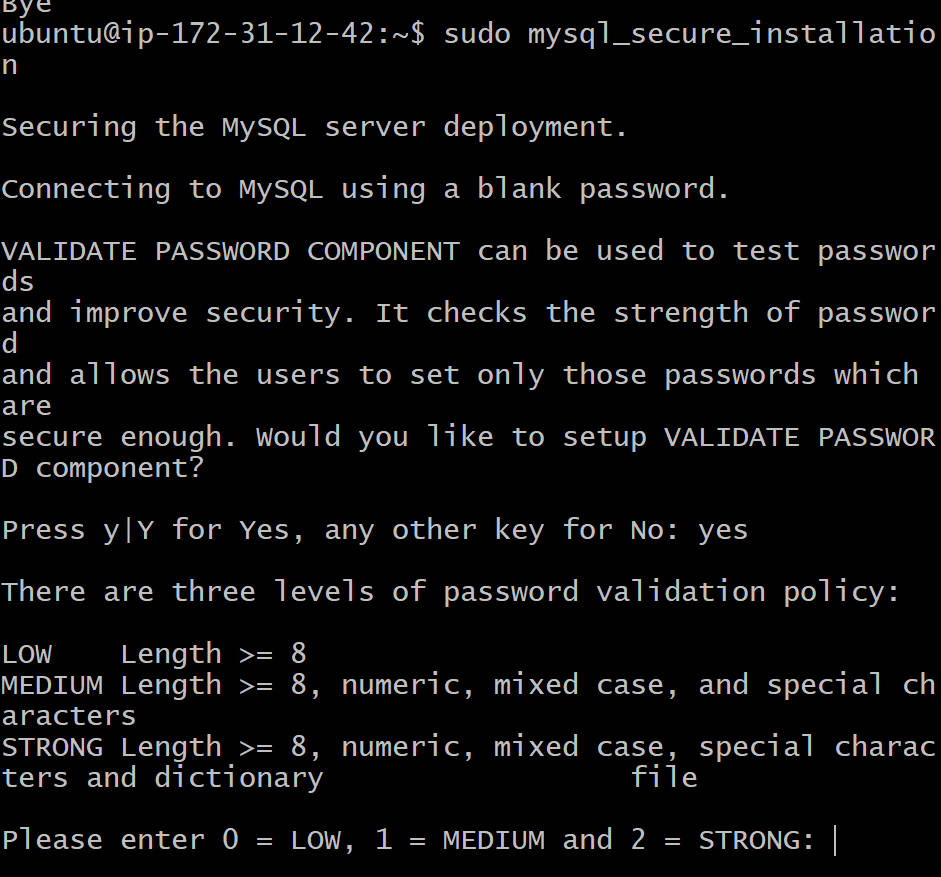
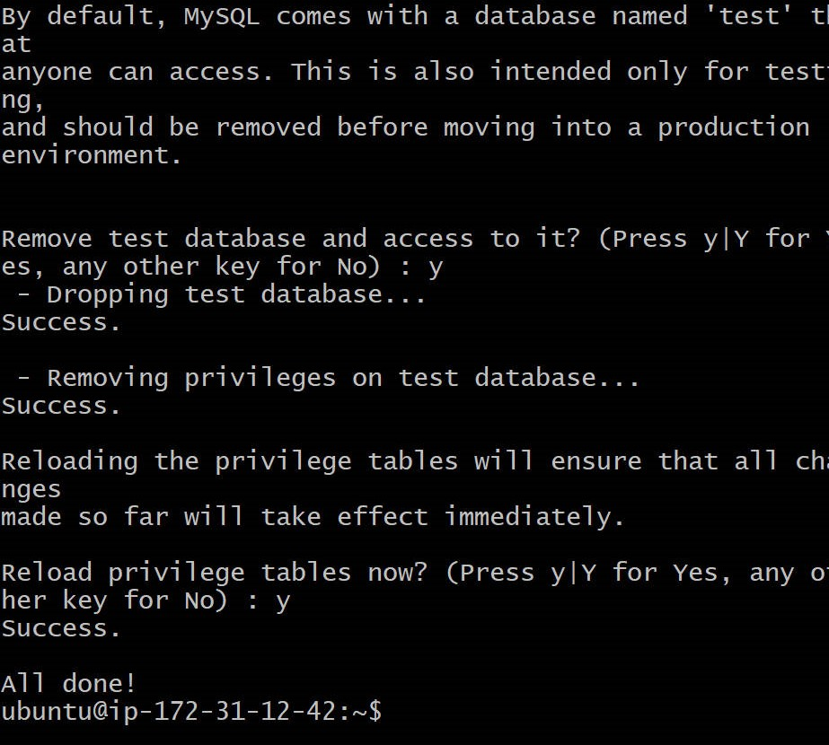
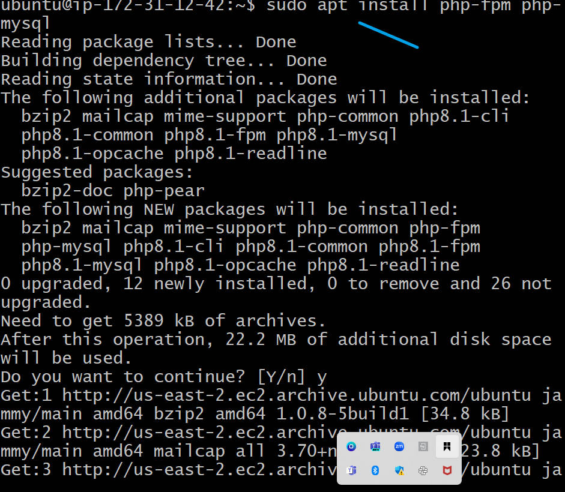
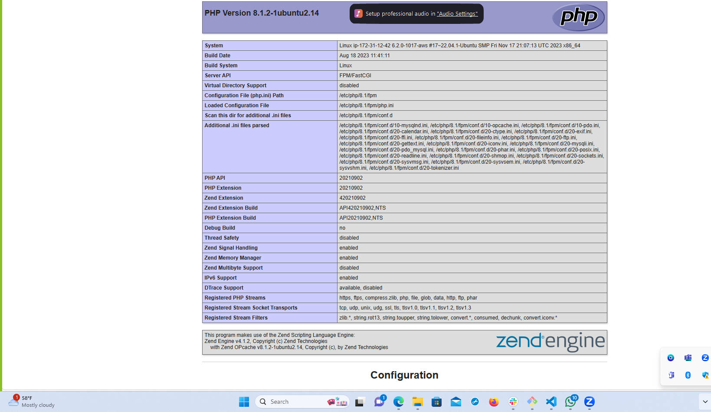

# Webstack Implementation

### The LEMP software stack is a group of software that can be used to serve dynamic web pages and web applications written in PHP. This is an acronym that describes a Linux operating system, with an Nginx (pronounced like “Engine-X”) web server. The backend data is stored in the MySQL database and the dynamic processing is handled by PHP.

# Set up Linux Environment
### Create an instance on AWS and then connect using SSH client

# Installing the Nginx Web Server

# Installing MySQL
### we now need to install the database system to be able to store and manage data for your site. MySQL is a popular database management system used within PHP environments.

### When the installation is finished, it’s recommended that you run a security script that comes pre-installed with MySQL. This script will remove some insecure default settings and lock down access to your database system.

### We can go ahead to view the databases available to us

### Adding a database to existing ones

### Tables can be created in the database to start with

#  Installing PHP
### While Apache embeds the PHP interpreter in each request, Nginx requires an external program to handle PHP processing and act as a bridge between the PHP interpreter itself and the web server. This allows for a better overall performance in most PHP-based websites, but it requires additional configuration. 

#  Configuring Nginx to Use the PHP Processor
### When using the Nginx web server, we can create server blocks (similar to virtual hosts in Apache) to encapsulate configuration details and host more than one domain on a single server. Here, i’ll use my_domain as an example domain name.
### i'll create a root web directory

### On Ubuntu 20.04, Nginx has one server block enabled by default and is configured to serve documents out of a directory at /var/www/html. While this works well for a single site, it can become difficult to manage if you are hosting multiple sites. Instead of modifying /var/www/html, we’ll create a directory structure within /var/www for the your_domain website, leaving /var/www/html in place as the default directory to be served if a client request doesn’t match any other sites.

# Testing PHP with Nginx
### our LEMP stack should now be completely set up. You can test it to validate that Nginx can correctly hand .php files off to our PHP processor.

### You can do this by creating a test PHP file in your document root. Open a new file called info.php within the document root in our text editor:

# Testing Database Connection from PHP
### The following command creates a new user named example_user, using mysql_native_password as default authentication method. We’re defining this user’s password as PassWord.1, but you should replace this value with a secure password of your own choosing.

### This will give the example_user user full privileges over the example_database database, while preventing this user from creating or modifying other databases on your server

### WE CAN VIEW THE TABLE

### we can now launch our webpage
  
_______              