# LEMP STACK IMPLEMENTATION (PROJECT 12)
### We are setting up a LEMP STACK using EC2, to do this we need to first do the following:

### . create an account on AWS.
### . I created an instance (virtual machine) by selecting "ubuntu server 20.04.6 LTS" from Amazon Machine Image(AMI)(free tier).
### . I selected "t2.micro(free tier eligible)"
### .Then go to the security group and select "a security group" review and launch

### How to create an aws free tier account. Click [here](**https://www.youtube.com/watch?v=bkS6JyIo4WY**)

### This launches us into the instance as shown in the following screenshot:
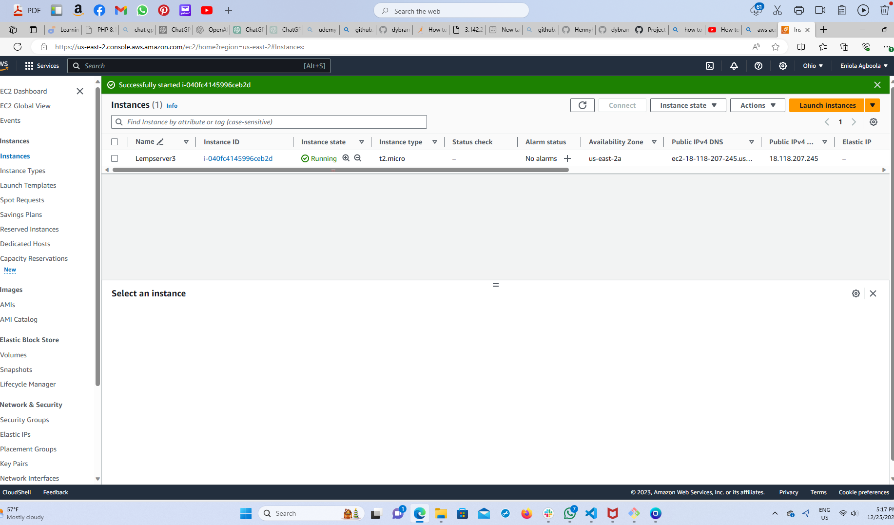
### I open my terminal,  cd into Download file and go to the location of the previously downloaded PEM file:
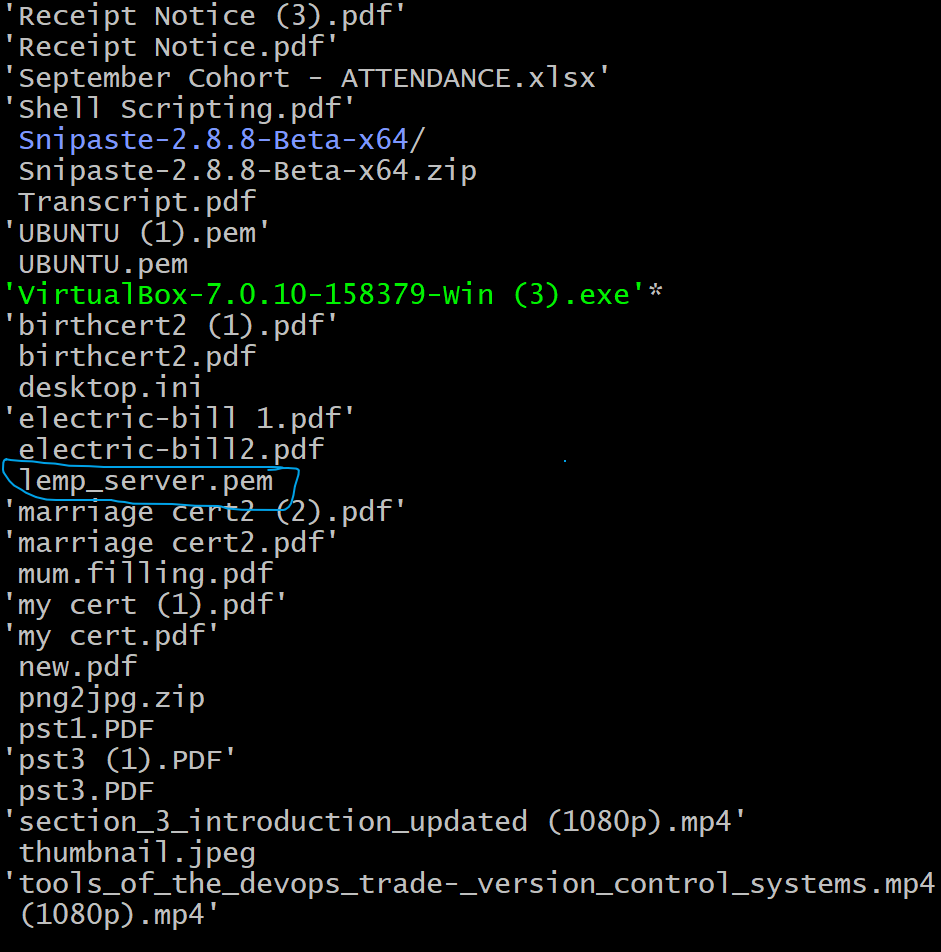
### To download PEM File from AWS.Click [here]( https://intellipaat.com/community/52119/how-to-download-a-pem-file-from-aws).
### We connect to the instance from our ubuntu terminal using the command: 
"$ ssh -i "lemp_server.pem" ubuntu@ec2-18-118-207-245.us-east-2.compute.amazonaws".
 
 ### This automatically connects to the instance.

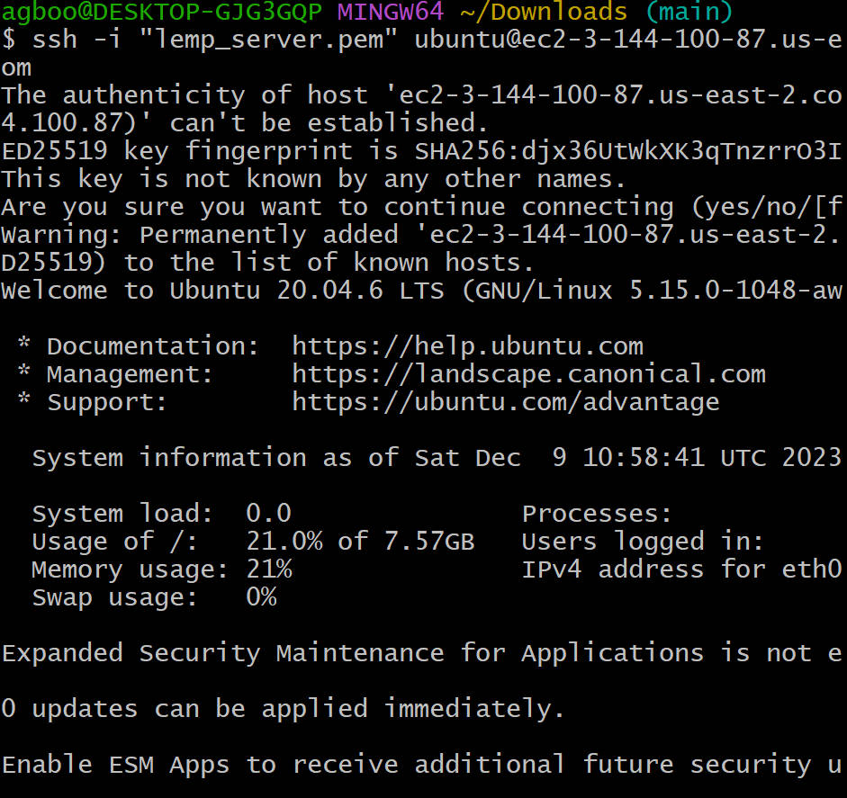

## SETTING UP NGINX WEB SERVER
### To download the nginx web server,we first update the server's package.
"$ sudo apt update"
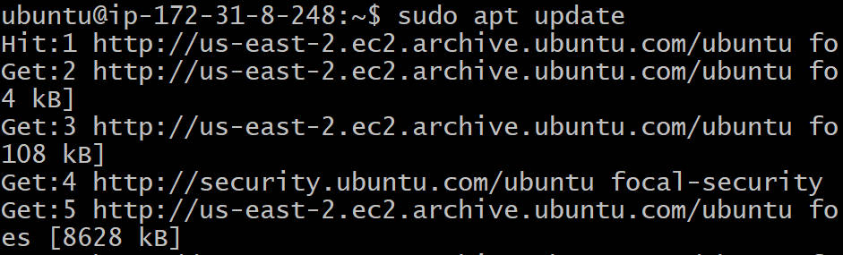

### After the update,we then go ahead to install the nginx web server by running:
"$ sudo apt install nginx"
### then click on "y" to confirm installation.
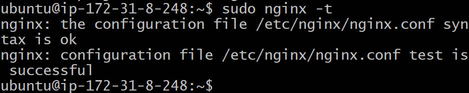
### To verify that nginx was downloaded and installed successfully,I run the command below:
"$ sudo systemctl status nginx"
### if it shows "green" and "active"(running),then it was successfully installed but if it doesn't shows "active" you will re-install before proceeding.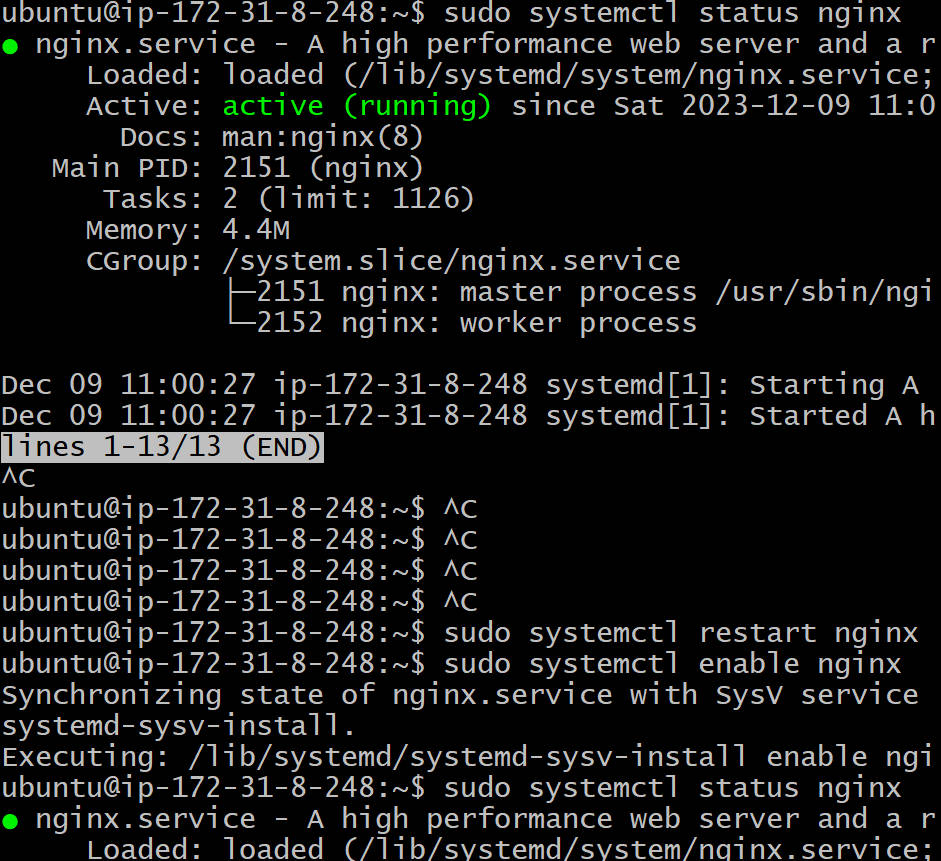
### Then move to my instance to set the inbound rules and save
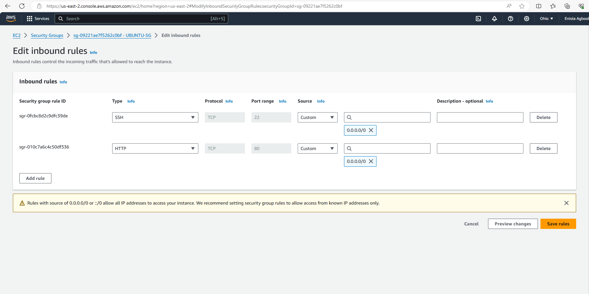
### To test how my Nginx server responds to requests from the internet,I open my browser and use this url:
http://[Public-IP-Address]:80
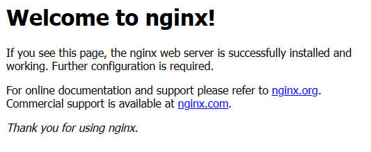 You can also test it  locally by running the following command in ubuntu:
"$ curl http://localhost:80" 
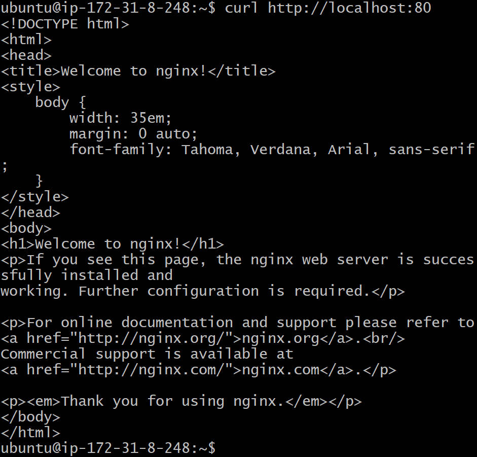
## SETTING UP MYSQL DATABASE
### Now that I have my webserver up and running,I need a Database Management System(DBMS)
### To install Mysql server,I run the command:
"$ sudo apt install mysql-server"
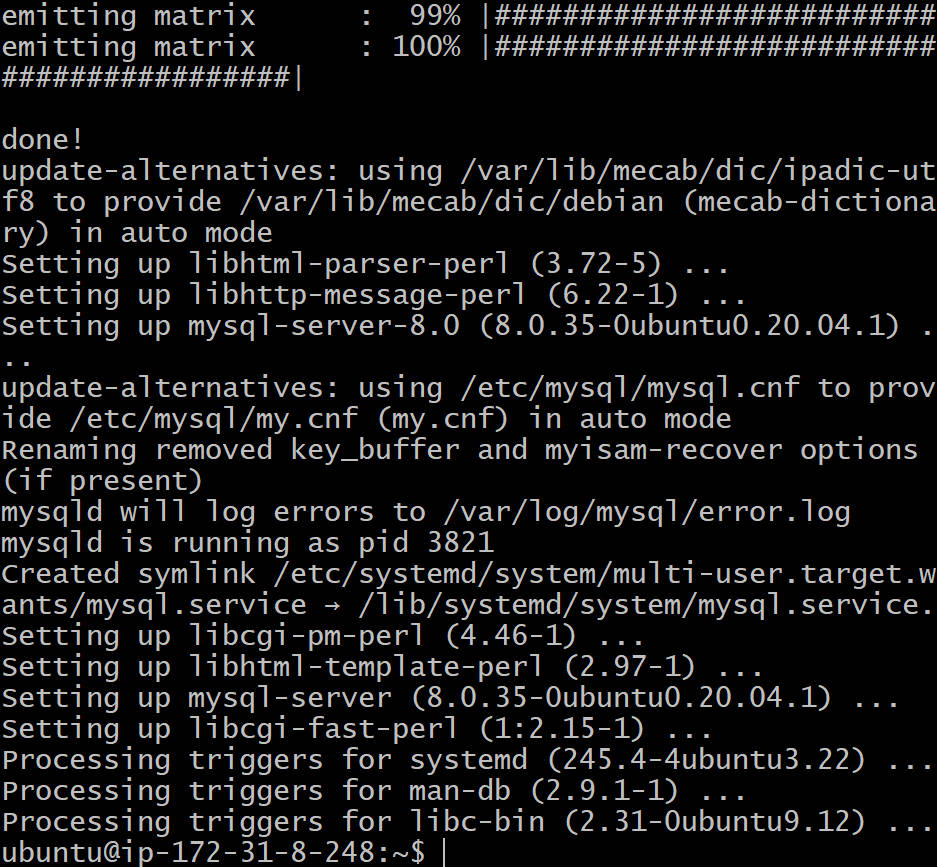
### I click on"y" to confirm installation.
### When installation is done,I log in by running the command:
"$ sudo mysql"
### This will connect to the MySQL server as the administrative database user root:

### I run a security script that comes pre-installed with MySQL.This script will remove some insecure default settings and lock down access to your database system.Before running the script you will set a password for the root user,using"mysql_native_password" as default authentication method.I choose a user's password as "PassWord.1"
"ALTER USER 'root'@'localhost' IDENTIFIED WITH mysql_native_password BY 'PassWord.1';"
### I "exit" mysql and start  the interactive script by running the command:
"$ sudo "mysql_secure_installation"
### This will ask for password,create password you  want and go ahead by typing "yes" to all subsequent prompts.
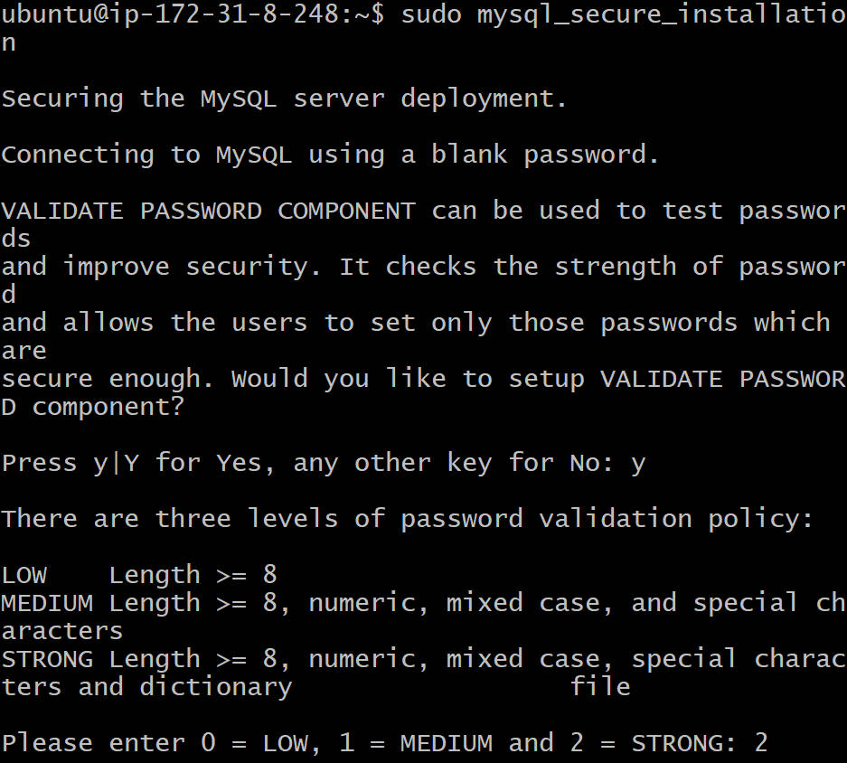
### When we are done,we test if we can log into the mysql by running the following command:
"$ sudo mysql -p"
### There will be a prompt for you to put in the password you created earlier.
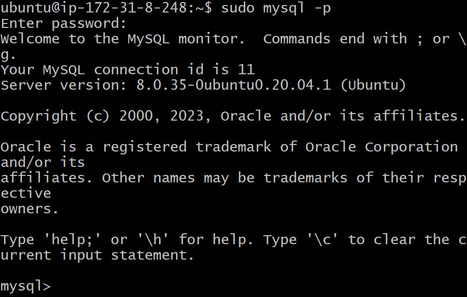
### then "exit" mysql console.
## SETTING UP PHP
### We have the Nginx server running for the web server and the mysql to handle the database.We need to install PHP to handle the codes.To install PHP ,we run the command:
"$ sudo apt install php-fpm php-mysql"
### we type "y" at the prompt and click_"ENTER"_
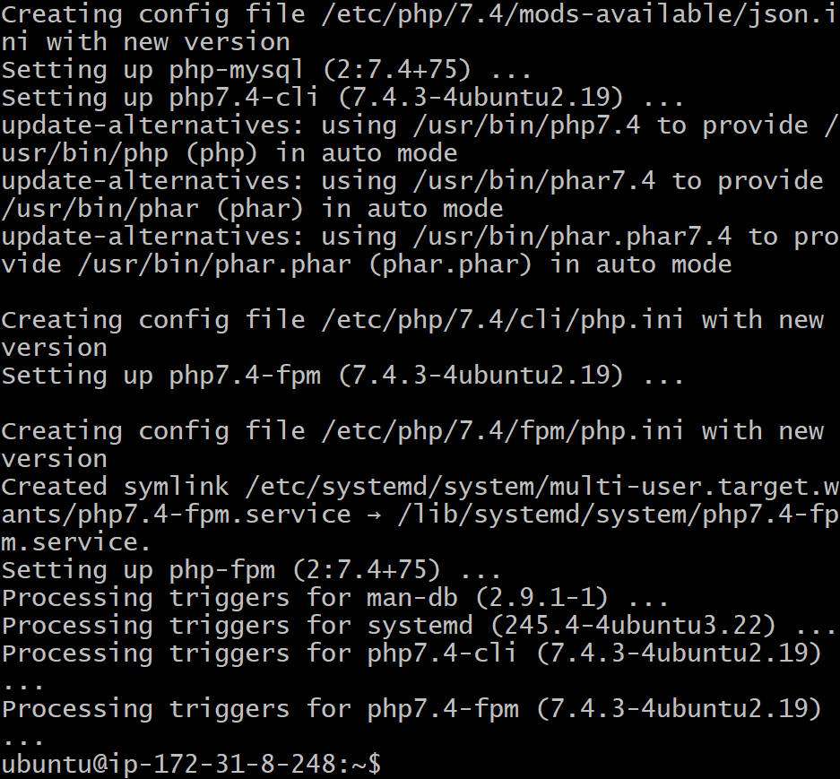

## CONFIGURING NGINX TO USE PHP PROCESSOR
### To set up the Nginx for using PHP processor,we first create a root web directory by creating a directory in "/var/www/" 
"$ sudo mkdir /var/www/projectLEMP"
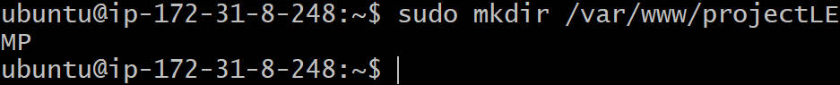
### next assign ownership to the directory
"$ sudo chown -R $USER:$USER /var/www/projectLEMP"
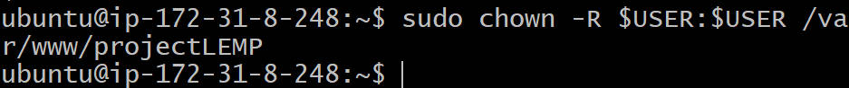
### create and open a new configuration file in Nginx"s sites-available
"$ sudo nano /etc/nginx/sites-available/projectLEMP"
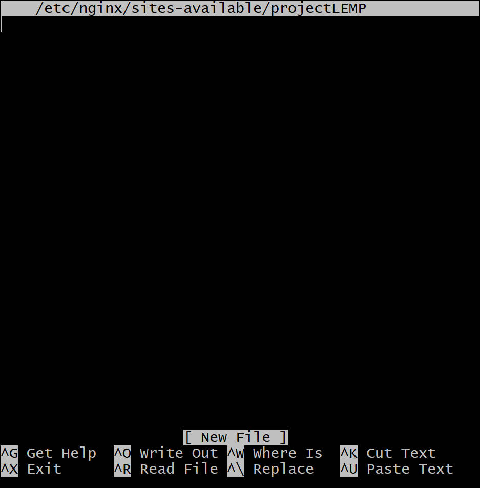
### paste in the following:
"#/etc/nginx/sites-available/projectLEMP
server {
    listen 80;
    server_name projectLEMP www.projectLEMP;
    root /var/www/projectLEMP;

    index index.html index.htm index.php;

    location / {
        try_files $uri $uri/ =404;
    }

    location ~ \.php$ {
        include snippets/fastcgi-php.conf;
        fastcgi_pass unix:/var/run/php/php8.1-fpm.sock;
     }

    location ~ /\.ht {
        deny all;
    }

}"
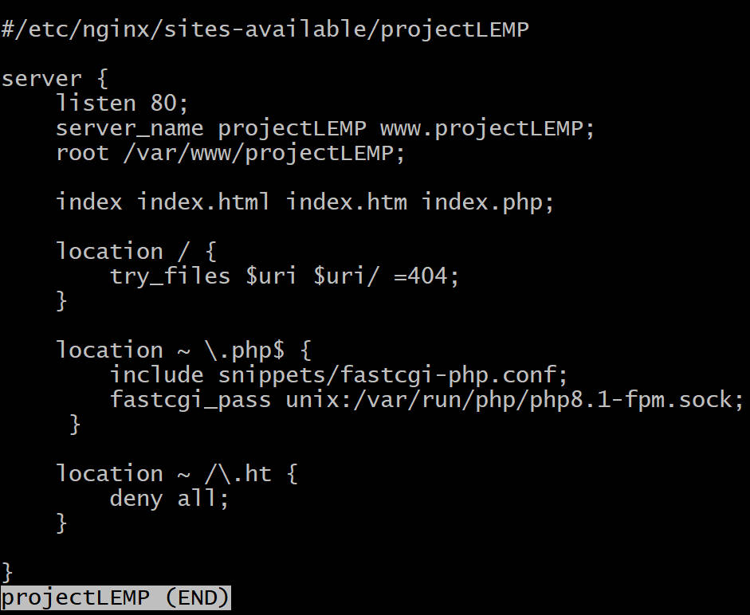
### then click "q",then ctrl+x to exit.
### To activate the configuration,we link to the configuration file in Nginx's sites-enabled directory:
"$ sudo ln -s /etc/nginx/sites-available/projectLEMP /etc/nginx/sites-enabled/"
### This will instruct the Nginx to use the configuration next time it is loaded.We then run the command:
"$ sudo nginx -t"
### we will see the following:

### If it displays any errors,we go back t review the configurations.
### To disable the default Nginx host that is currently configure to listen on port 80
"sudo unlink /etc/nginx/sites-enabled/default"
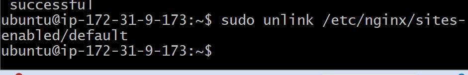
### we will reload Nginx by running the following command:
"$ sudo systemctl reload nginx"

### The new website is now active,but the web root"/var/www/projectLEMP" is still empty.
### We create an "index.html" in the "var/www/projectLEMP" directory:
"sudo echo 'Hello LEMP from hostname' $(curl -s http://169.254.169.254/latest/meta-data/public-hostname) 'with public IP' $(curl -s http://169.254.169.254/latest/meta-data/public-ipv4) > /var/www/projectLEMP/index.html"
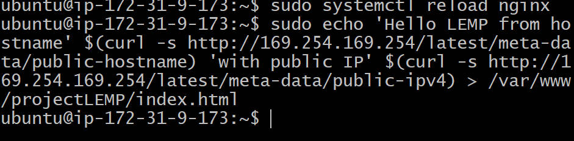
### We go to the browser and try to open the URL using IP address
"http://[Public-IP-Address]:80"
### We should see the text from the echo command.This shows that the Nginx site is working as expected
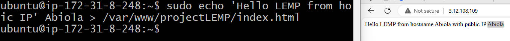
## TESTING PHP WITH NGINX
### The LEMP stack is completely set up.To test that the Nginx can hand .php files to the PHP processor,we create a file "info.php in the "/var/www/PROJECTLEMP"
"$ nano /var/www/projectLEMP/info."php"
### and paste the following:
"<?php
phpinfo();
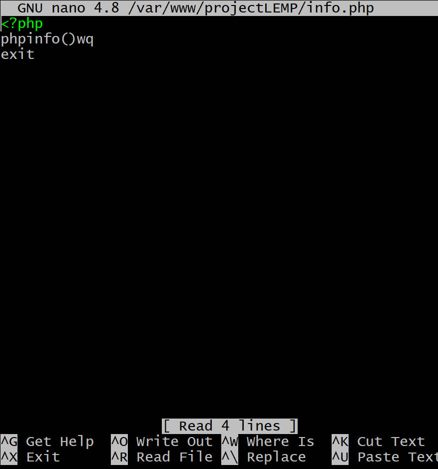
### We can now access this by adding info.php to the URL on the browser
http://`server_domain_or_IP`/info.php
### We should see a web page containing information about PHP
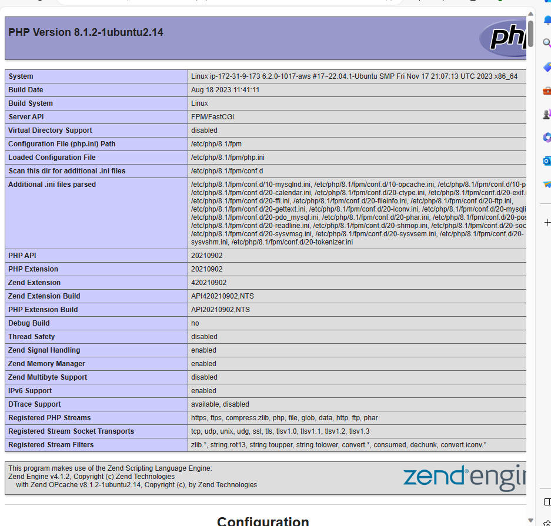
### It is better to remove the file you created as it contain sensitive information about the PHP environment and the ubuntu server so in that case we run the following command:
"$ sudo rm /var/www/your_domain/info.php"
### But you can regenerate this file if you need it later.
## RETRIEVING DATA FROM MySQL DATABASE WITH PHP
### Let us create a database named"example_database"and a user named "example_user",but you replace these names with different values.First of all we run the following command:
"$ sudo mysql"

                                                                                                                                                                                                                                                                                                                                                                                                                                                                                                                                                                                                                                                                                                                                                                                                                                    

