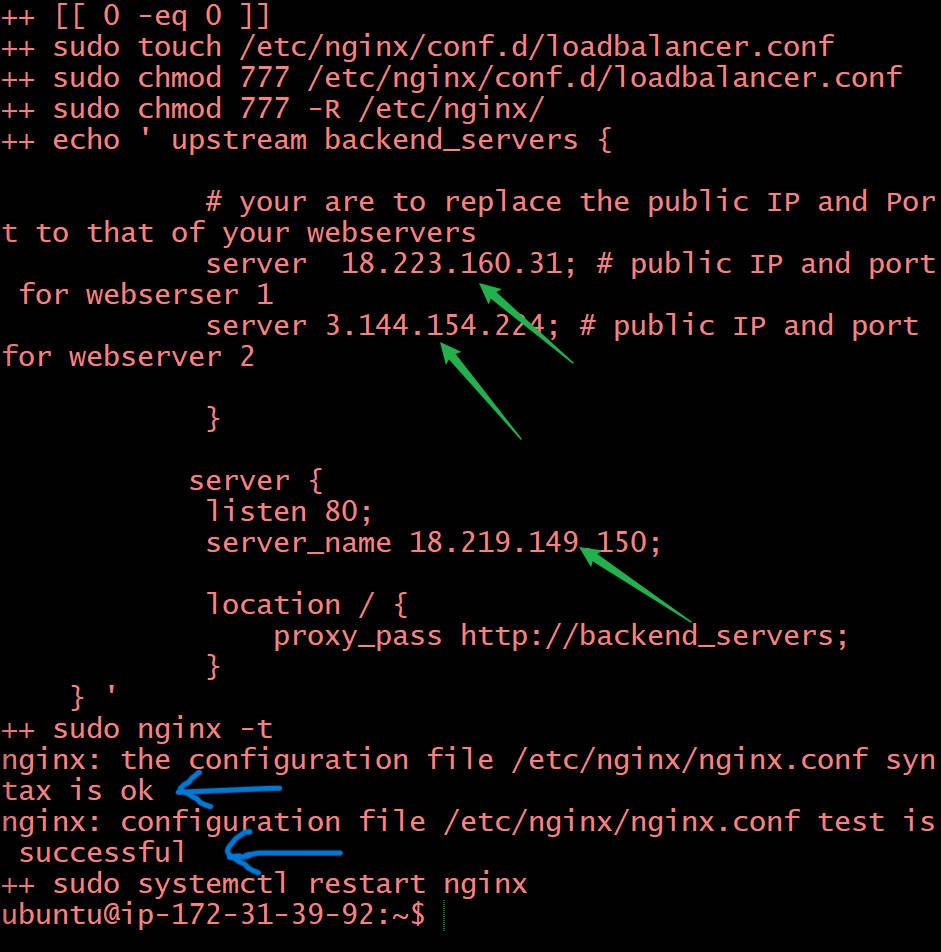

# Automating Loadbalancer configuration with Shell scripting
## This project demonstrates how to automate the setup and maintainance of your load balancer using a freestyle job,enhancing and reducing manual effort.
# Automate the Deployment of Webservers
## In the implementing load balancer with Nginx course.We first deployed two backend servers,with a load balancer distributing traffic across the webservers.We did that by typing a commands right on our terminal.Here we will be automating the entire process.We will do writing a shell scripting that when ran,all that will did manually will be done for us automatically.As DevOps Engineers automation is at the heart of the work we do.Automation helps us speed the deployment of services and reduce the chance of making errors in our day to day activity.We launch two instance running ubuntu 20.04 and open Port 8000 to allow traffic from anywhere using the security group,then connect to the webservers via the terminal using SSH Clientthen install shellscripting into the 2 shell scripting ,change the permission on the file to make it executable by running the following command,we now install shellscripting with the webservers Public_IP and check them on Browser.
# Deploying and configuring Nginx Load Balancer
## Again we launch another instance and allow Port 80 and open a terminal to SSH for the load balancer,We open a file and change the file permission to make it an executable then we run the script with the public_IP using the {3} public_IP servers the configuration of the file is OK and successfull.Lastly put the Public_IP of the load balancer on the browser to verify the setup
#   Congratulations!!!