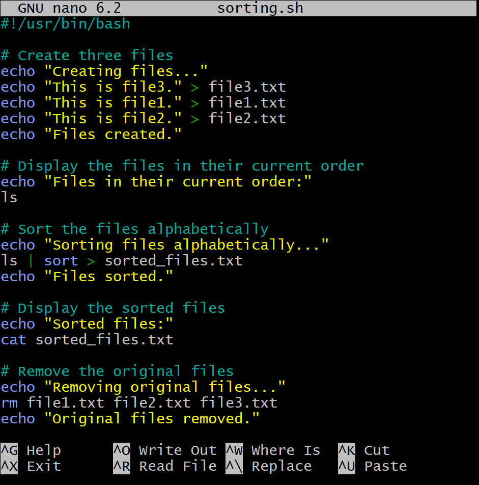

# Shell-scripting

## This is a way of writing a series of commands in a file that can be executed by a shell program.A shell is an interface that interprets and executes these commands on an operating system.Shell scripting can help you to automate repetive tasks,save time and reduce errors.Examples of shell scripting commands are:
### *echo: Print a message to the standard output.
### *ls: Lists the files and directories in the current directory.
### *chmod: Changes the permissions of a file or directory.
### *if : Executes a command or a block of commands based on a condition.

## To begin shell scripting,I login to my AWS to create an instance, then click on connect  to copy SSH command in SSH Client, open git bash and cd to Download in order to paste my SSH command as follows:

# There are various syntax elements in shell scripting which are:*Variables**,*Control flow*,*Command substitution*,*Input and Output* and *Functions*

## First of all before starting my project I make a directory which is [shell-scripting]then create a file using command {touch user-input.sh} and check my bash using command "which bash" then "nano user-input" inside the file copy and paste the block of code as follow: then run the script using command"./user-input.sh" and the output are:.
# Directory Manipulation and Navigation

## Directory manipulation and navigation are two essential skills for working with files and folders in linux.Directory manipulation involves creating,removing,moving,and renaming directories.Directory navigation involves moving from one directory to another and finding out what is inside a directory.

## working on the project,I first created a directory inside my current directory then cd into the directory I created and also create two files inside it,I move one step back and remove the directory I created with its content by using command [rm -r"directory name"] then nano and paste the files as follows:,save the file and exit to run the command of setting execution permission on the file and again run the script using this command"./navigating-linux-filesystem.sh" below are result:

# File Operations and sorting
## File operations are actions that can be performed on files,such as creating,opening,reading,writing,deleting,copying,moving renaming and so on.Sorting is the process of arranging the contents of a file in a specific order,such as alphabetical,numerical,or chronological.File operations and sorting are important for managing and organizing data efficiently.I open my terminal and create a file called sorting.sh using the command "touch sorting.sh"then nano to copy and paste  the codee block into the file: ,next set execution permission on sorting.sh and run the script as follows:
# Working with Numbers and Calculations
## This variables defines two variables num1 and num2 with numeric values, performs basic arithmetic operations(addition,subtraction,multiplication,division,and modulus),and displays the results.It also performs more complex calculations such as raising num1 to the power of 2 and calculating the square root of num2,and displays those results as well.On my terminal,I created a file called calculations.sh by using the following command"touch calculations.sh" then Nano to copy and paste the code block below:
##  then set the execution permission on it by using the following command{sudo chmod +x calculation.sh} run the script as follows:.
# File Backup and Timestamping
## As a DevOps Engineer backing up databases and other storage devices is one of the most common task you get to carryout.This script defines the source directory and backup directory paths.It then creates a timestamp using the current date and time,and creates a backup directory with the timestamp appended to its name.The script then copies all copies all files from the source directory to the backup directory using the cp command with the -r option for recursive copying.Finally,it displays a message indicating the completion of the backup process and shows the path of the backup directory with the timestamp.
## On my terminal,I open a file backup.sh using the command"touch backup.sh" then Nano to copy and paste the code block into the file as follows: then execute permission and run the script  follow:.

